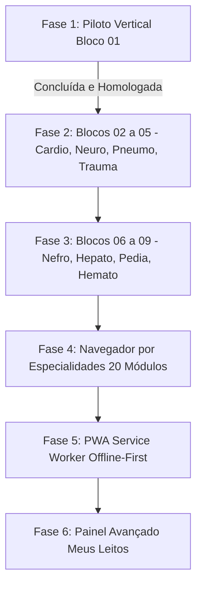

# Plano de Próximos Passos: Scoreboard App

Com a **Fase 1 (Piloto Vertical do Bloco 01)** concluída e 100% homologada (arquitetura base, motores puros, catálogo A-Z, régua alfabética estilo iOS, favoritos com IndexedDB, tema claro/escuro premium, radar SVG a 60fps e micro-calculadora de BIC), este documento define o roteiro de execução das etapas subsequentes para atingir o catálogo completo de 98 escores e capacidade PWA offline.

---

## Roteiro Estratégico de Próximos Passos

---

## 1. Fase 2: Expansão dos Blocos Clínicos 02 a 05
**Objetivo:** Adicionar as ferramentas mais utilizadas na Sala Vermelha, Enfermarias e Emergência Clínica e Cirúrgica, mantendo a regra de Anti-Truncamento.

- **Bloco 02 — Cardiologia e Hemodinâmica (Módulos 05 a 07):**
  - *Módulo 05 (SCA):* HEART Score, TIMI Risk (IAM c/ e s/ supra), GRACE 2.0, Killip-Kimball.
  - *Módulo 06 (Fibrilação Atrial):* CHA2DS2-VASc, HAS-BLED, ATRIA.
  - *Módulo 07 (Insuficiência Cardíaca):* Critérios de Framingham, NYHA, MAGGIC Risk.
  - *Entregável:* `src/data/blocks/block_02.json` e expansão dos sinônimos no `manifest.json`.

- **Bloco 03 — Neurologia e Neurocirurgia (Módulo 08):**
  - NIHSS (com cálculo automático de déficit neurológico), ABCD2 (risco de AIT $\rightarrow$ AVC), ICH Score (hemorragia intraparenquimatosa), Escala de Fisher (HSA e vasoespasmo), Hunt-Hess, ASPECTS (tomografia no AVC isquêmico), EDSS.
  - *Entregável:* `src/data/blocks/block_03.json`.

- **Bloco 04 — Pneumologia (Módulos 09 e 10):**
  - *Módulo 09 (PAC):* CURB-65, CRB-65, PSI/PORT, SMART-COP.
  - *Módulo 10 (DPOC e Asma):* Classificação moderna **GOLD ABE (2024/2025)**, Índice BODE, Escala mMRC de dispneia, Wood-Downes para crise asmática.
  - *Entregável:* `src/data/blocks/block_04.json`.

- **Bloco 05 — Cirurgia Geral e Trauma (Módulos 11 a 13):**
  - *Módulo 11 (Abdome Agudo):* Escore de Alvarado, RIPASA, Critérios de Tokyo para colecistite/colangite.
  - *Módulo 12 (Trauma e Queimaduras):* RTS, ISS, TRISS; Diretriz **ABA Moderna ($2\text{ mL/kg/% SCQ}$)** com comutador para **Parkland Tradicional ($4\text{ mL}$)** para trauma elétrico.
  - *Módulo 13 (Risco Cirúrgico):* Classificação ASA, Índice Cardíaco de Goldman, RCRI de Lee, Escore de Caprini para profilaxia de TEV.
  - *Entregável:* `src/data/blocks/block_05.json`.

---

## 2. Fase 3: Expansão dos Blocos Clínicos 06 a 09
**Objetivo:** Completar o catálogo monográfico com os 98 escores das especialidades clínicas complexas.

- **Bloco 06 — Nefrologia e Meio Interno (Módulos 14 e 15):**
  - *Módulo 14 (Renal):* KDIGO/AKIN para IRA, RIFLE, **CKD-EPI 2021 (race-free)**, Cockcroft-Gault para ajuste de dose farmacológica.
  - *Módulo 15 (Distúrbios Hidroeletrolíticos):* Ânion Gap, Delta Gap, Déficit de Água Livre na hipernatremia, Correção de Sódio na hiperglicemia.
  - *Entregável:* `src/data/blocks/block_06.json`.

- **Bloco 07 — Hepatologia e Gastroenterologia (Módulos 16 e 17):**
  - *Módulo 16 (Hepatopatias):* Child-Pugh, **MELD-Na oficial (SUS / Ministério da Saúde)** com comparativo informativo para **MELD 3.0**, Função Discriminante de Maddrey.
  - *Módulo 17 (Hemorragia Digestiva):* Escore de Rockall, Glasgow-Blatchford (triagem para EDA precoce), AIMS65.
  - *Entregável:* `src/data/blocks/block_07.json`.

- **Bloco 08 — Pediatria e Neonatologia (Módulos 18 e 19):**
  - *Módulo 18 (Neonatologia):* Apgar de 1º e 5º minutos, Boletim de Silverman-Andersen, Ballard/Capurro, Zonas de Kramer.
  - *Módulo 19 (Emergência Pediátrica):* PEWS (*Pediatric Early Warning Score*), Glasgow Pediátrico, PELOD-2 para disfunção orgânica, Regra de Holliday-Segar para hidratação venosa.
  - *Entregável:* `src/data/blocks/block_08.json`.

- **Bloco 09 — Hematologia e Reumatologia (Módulo 20):**
  - Índice de Mentzer (triagem beta-talassemia vs ferropriva), Escore de CIVD da ISTH, Escore 4Ts para Trombocitopenia Induzida por Heparina (HIT).
  - *Entregável:* `src/data/blocks/block_09.json`.

---

## 3. Fase 4: Navegador por Especialidades (20 Módulos)
- Implementação do componente `SpecialtyBrowser.tsx` integrado à aba "Especialidades" da barra de navegação inferior.
- Permite que o médico alterne entre:
  - Navegação Alfabética Rápida (A-Z) com a régua lateral.
  - Navegação Hierárquica por Bloco/Especialidade (ex.: Cardiologia $\rightarrow$ SCA $\rightarrow$ HEART).

---

## 4. Fase 5: PWA Offline-First & Service Worker
- Configuração de `vite-plugin-pwa` no `vite.config.ts`.
- Estratégia de cache-first para os 9 arquivos JSON modulares e o manifesto, permitindo funcionamento instantâneo em subsolos de hospitais e salas de isolamento sem sinal celular ou Wi-Fi.
- Manifesto de Web App (`manifest.webmanifest`) com ícones para instalação nativa na tela inicial do celular (Android e iOS).

---

## 5. Fase 6: Painel Avançado do Modo "Meus Leitos"
- Implementação de `BedsManager.tsx` na aba "Meus Leitos".
- Recursos:
  - Criação rápida de leitos transitórios anônimos ("Leito 01 - UTI", "Box 03 - Sala Vermelha").
  - Associação de múltiplos escores calculados para o mesmo leito ao longo do plantão (ex.: qSOFA na admissão, SOFA às 12h, BIC de noradrenalina ativa).
  - Visualização de evolução temporal dos desvios fisiológicos.
  - Exportação em lote de resumo do plantão para passagem de caso (Round).
