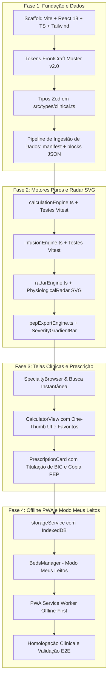

# Roadmap e Backlog de Execução: Scoreboard App

Este documento detalha as 4 fases sequenciais de implementação do Scoreboard App, estabelecendo critérios de aceitação e a ordem lógica de execução.

---

## Fluxo Geral de Fases

---

## Detalhamento das Fases

### Fase 1: Fundação do App e Ingestão de Dados
- **Objetivo:** Estabelecer a base técnica do aplicativo, tipos Zod rigorosos e dados modulares dos 98 escores sem risco de truncamento.
- **Tarefas:**
  1. `package.json`, `tsconfig.json`, `vite.config.ts`, `tailwind.config.js`, `postcss.config.js`.
  2. Instalação de dependências: `react`, `react-dom`, `lucide-react`, `zod`, `clsx`, `tailwind-merge`, `idb`. Dev: `vite`, `vitest`, `@testing-library/react`, `vite-plugin-pwa`, `tailwindcss`.
  3. Integração dos tokens táteis do FrontCraft Master em `src/index.css` e `tailwind.config.js` (chanfros de 1px, sombras multicamada, paleta médica).
  4. Modelagem dos schemas Zod em `src/types/clinical.ts`:
     - `Calculator`, `ParameterGroup`, `ParameterOption`, `RiskTier`, `ClinicalAction`, `InfusionProtocol`, `RadarAxis`.
  5. Script / pipeline de extração e validação dos 9 blocos modulares (`src/data/blocks/block_01.json` a `block_09.json`) e `src/data/manifest.json`.
- **Critério de Aceitação:** `npm run build` executa sem erros; schemas Zod validam os dados dos blocos gerados sem discrepâncias.

### Fase 2: Motores Puros e Visualização Fisiológica
- **Objetivo:** Implementar toda a inteligência médica e física matemática de forma pura, isolada de UI, com 100% de testes unitários.
- **Tarefas:**
  1. `src/engines/calculationEngine.ts`:
     - Executores para modelos aditivos de pontos, equações contínuas e árvores de decisão.
     - Testes unitários para escores representativos (HEART, SOFA, CURB-65, CKD-EPI, Parkland).
  2. `src/engines/infusionEngine.ts`:
     - Cálculo físico de vazão em BIC ($mL/h$), taxa de titulação e conversões.
     - Testes unitários para Noradrenalina, Vasopressina, Dobutamina e Tridil.
  3. `src/engines/radarEngine.ts`:
     - Normalização paramétrica dos eixos e cálculo das coordenadas $(x, y)$ dos polígonos.
  4. `src/components/radar/PhysiologicalRadar.tsx`:
     - Componente SVG puro com polígono verde de higidez e sobreposição reativa do paciente.
  5. `src/engines/pepExportEngine.ts`:
     - Gerador de relatório estruturado para colagem em prontuário eletrônico.
- **Critério de Aceitação:** `npx vitest run` atinge 100% de aprovação nos testes dos motores clínicos.

### Fase 3: Interface Clínica e Prescrição Integrada
- **Objetivo:** Oferecer a melhor experiência mobile para o médico plantonista, eliminando o garimpo de tabelas.
- **Tarefas:**
  1. Header e Navegador de Especialidades (`src/components/navigation/SpecialtyBrowser.tsx`):
     - Navegação nos 9 blocos e 20 módulos.
     - Barra de pesquisa com busca instantânea por nome, sigla e termos-chave.
     - Lista de Favoritos (Quick-Pins ⭐).
  2. Interface de Cálculo (`src/components/calculator/CalculatorView.tsx`):
     - Seletores táteis de alta ergonomia (mínimo 48×48px, One-Thumb Zone).
     - Atualização do Radar e Barra de Gradiente em tempo real.
  3. Card de Prescrição e Conduta (`src/components/prescription/PrescriptionCard.tsx`):
     - Estratificação de risco e desfecho estatístico validado.
     - Condutas farmacológicas completas com doses e diluições.
     - Calculadora de BIC acoplada à conduta.
     - Condutas não farmacológicas e destino (alta, observação, enfermaria, UTI).
     - Botão de um toque "Copiar para PEP" com feedback hápitico/visual.
- **Critério de Aceitação:** Fluxo completo em 3 toques testado e responsivo em viewports móveis (360px a 430px).

### Fase 4: Modo Meus Leitos e PWA Offline-First
- **Objetivo:** Garantir a persistência local do plantão e operação confiável sem sinal de internet em subsolos e salas blindadas.
- **Tarefas:**
  1. `src/services/storageService.ts`:
     - Persistência em IndexedDB para leitos, notas rápidas e histórico de cálculos.
  2. `src/components/beds/BedsManager.tsx`:
     - Painel visual dos leitos acompanhados no plantão com códigos anônimos ("Leito 03 - UTI").
  3. Service Worker com `vite-plugin-pwa`:
     - Estratégia de cache-first para manifesto e blocos JSON.
  4. Homologação final e documentação de entrega.
- **Critério de Aceitação:** Aplicação funciona 100% offline após primeiro carregamento e dados de leitos persistem entre recargas de página.
