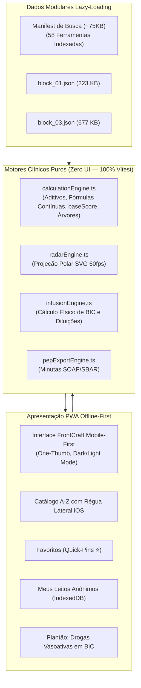
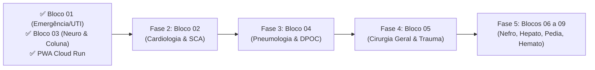

# 🩺 Scoreboard App — Clinical Decision Support System (CDSS)

[](https://scoreboard-app-1044179901556.us-east1.run.app)
[](https://github.com/melkidonadonmed-lgtm/scoreboard)
[](https://scoreboard-app-1044179901556.us-east1.run.app)
[](https://github.com/melkidonadonmed-lgtm/scoreboard)
[](https://scoreboard-app-1044179901556.us-east1.run.app)
[](https://github.com/melkidonadonmed-lgtm/scoreboard)

> [!IMPORTANT]
> **Acesso Direto em Produção (PWA Mobile-First):**
> O Scoreboard App está publicado e acessível em: **[https://scoreboard-app-1044179901556.us-east1.run.app](https://scoreboard-app-1044179901556.us-east1.run.app)**
> 📲 **Instalação no Celular:** Ao abrir o link no Safari (iOS) ou Chrome (Android), toque em **"Adicionar à Tela de Início"**. O app opera como aplicativo nativo e funciona **100% offline** (em centros cirúrgicos, salas de isolamento e subsolos sem sinal).

> [!NOTE]
> **Aviso Regulatório e Isenção de Responsabilidade Médica (SaMD):**
> O **Scoreboard App** atua estritamente como sistema de apoio e suporte à decisão clínica informada (*Clinical Decision Support System - CDSS*), em conformidade com a **RDC ANVISA nº 657/2022** e com os pareceres do **Conselho Federal de Medicina (CFM)**. As pontuações, probabilidades estatísticas e minutas de condutas baseiam-se em diretrizes médicas públicas consensuadas (AMIB, SBC, SBPT, AHA, ESC, KDIGO, Brain Trauma Foundation, AO Spine, NOMS) e têm finalidade exclusivamente consultiva e educacional. O aplicativo **não substitui** o exame físico presencial, a anamnese detalhada e o julgamento soberano e individualizado do médico assistente.

---

## 💡 Visão Geral e Proposta de Valor

### 🩺 Da Atenção Básica e Sala Vermelha ao Centro Cirúrgico e UTI
O **Scoreboard App** elimina o retrabalho e a fragmentação no atendimento médico:
- **Zero "Garimpo de Tabelas":** Em vez de calcular uma pontuação e depois caçar condutas, doses e diluições em PDFs dispersos, toda pontuação calculada traduz-se automaticamente em **quatro dimensões clínicas simultâneas**:
  1. **Estratificação Estatística Validada:** Risco empírico concreto (mortalidade intra-hospitalar, MACE em 6 semanas, taxa de sangramento maior, probabilidade pré-teste).
  2. **Dashboard de Desvio Fisiológico:** Gráfico Radar multidimensional em SVG nativo a 60fps contrastando a homeostase normal com o desvio patológico agudo do paciente.
  3. **Conduta Terapêutica & Cirúrgica Estruturada:** Fármacos de escolha com doses de ataque e manutenção, diluições padronizadas AMIB, micro-calculadora de vazão de BIC em mL/h e alertas de indicação cirúrgica mandatória vs. conservadora.
  4. **Exportação Instantânea para PEP (1 Toque):** Minuta clínica estruturada no modelo SOAP/SBAR pronta para colar nos prontuários eletrônicos (**Tasy, MV Soul, Epimed, Pixeon**).

---

## 📊 O Que Está Entregue e Ativo Agora (58 Ferramentas Monográficas)

Atualmente o aplicativo conta com **58 calculadoras monográficas completas**, sem truncamento de variáveis ou condutas, divididas em dois grandes blocos clínicos:

### 1. Bloco 01 — Emergência, Choque e Terapia Intensiva (19 Instrumentos)
- **Sepse e Disfunção Orgânica:**
  - `qSOFA`: triagem rápida à beira do leito (*com aviso mandatório SSC 2021 desaconselhando uso isolado para exclusão de sepse*).
  - `SOFA`: disfunção orgânica seriada com radar de 6 eixos (Respiratório, Coagulação, Fígado, Cardiovascular, SNC, Renal).
  - `APACHE II` e `SAPS 3`: calibração de gravidade e predição de mortalidade em primeiras 24h de UTI.
- **Tromboembolismo Venoso (TVP e TEP):**
  - `Wells TEP` e `Wells TVP`: probabilidade pré-teste dicotômica e estratificada.
  - `Geneva Revisado`: predição objetiva sem variáveis dependentes de julgamento do examinador.
  - `PERC`: regra de exclusão clínica de baixo risco para dispensar D-Dímero.
  - `PESI` e `sPESI`: predição de mortalidade em 30 dias no TEP confirmado para decidir tratamento domiciliar vs internação/UTI.
- **Coma, Sedação e Delirium:**
  - `Glasgow-P`: escala de Glasgow integrada à reatividade pupilar (-2 a 0).
  - `FOUR Score`: escala de coma para pacientes intubados sem dependência de resposta verbal.
  - `RASS` e `SAS`: titulação de profundidade de sedação em UTI.
  - `CAM-ICU`: rastreio rápido de delirium hipoativo e hiperativo.
- **Pancreatite Aguda:**
  - `Critérios de Ranson` (admissão e 48h), `BISAP`, `Balthazar CTSI` (gravidade tomográfica) e `Marshall Modificado` (falência orgânica persistente vs transitória segundo Atlanta 2012).
- **Farmacotécnica & Micro-Calculadoras de Drogas Vasoativas em BIC:**
  - `Noradrenalina`: diluição padrão (16 mg em 234 mL SG 5% - $64\ \mu\text{g/mL}$) com aviso mandatório de veículo em SG 5% contra oxidação precoce.
  - `Vasopressina`: dose fixa de $0,01$ a $0,04\text{ UI/min}$ ($3$ a $12\text{ mL/h}$).
  - `Dobutamina`: inotrópico em SG 5% ($1.000\ \mu\text{g/mL}$).
  - `Nitroglicerina`: frasco não-PVC contra adsorção plástica.

---

### 2. Bloco 03 — Arsenal Completo de Neurocirurgia e Coluna Vertebral (39 Instrumentos)
Construído com base nos novos manuais práticos e dossiês do Google Drive (`Escores_Clinicos_em_Neurocirurgia_1.txt`, `SOS_Vascular.docx`, `SOS_Coluna.docx`, `SOS_Oncologia.docx`):

#### A. Neurotrauma & Neurointensivismo
- `Escore de Rotterdam (TCE)`: fórmula com `baseScore = 1`, dedução protetora de -1 para hematoma epidural e predição de mortalidade em 6 meses.
- `Classificação de Marshall (TCE)`: lesões difusas I a IV e lesões cirúrgicas de massa V e VI.
- `EDEMA Score`: predição precoce de edema maligno de artéria cerebral média e indicação de craniectomia descompressiva de urgência.
- `CRASH Trial Score (MRC)`: predição quantitativa de mortalidade aos 14 dias no TCE.
- `IMPACT Score`: prognóstico aos 6 meses no TCE moderado a grave (Marshall, tHSA, EDA, hipóxia, hipotensão).
- `Escala ASIA / AIS`: classificação padronizada ISNCSCI de trauma raquimedular (graus A a E).

#### B. Neurocirurgia Vascular, Aneurismas e MAVs
- `Hunt-Hess`: graus clínicos 1 a 5, grau 1a e ajuste sistêmico (+1).
- `WFNS`: matriz combinada de GCS e déficit motor focal na HSA aneurismática.
- `Fisher Clássica (1980)` e `Fisher Modificada (Claassen 2001)`: espessura de coágulo e hemorragia intraventricular bilateral.
- `Vasograde`: resolução bivariada dedicada cruzando WFNS e Fisher Modificada para estratificação de Isquemia Cerebral Tardia (DCI).
- `Spetzler-Martin Clássico` (I a V) e `Spetzler-Martin Suplementar (Lawton-Young)`: idade, hemorragia prévia e compacidade do nidus para determinação de morbidade cirúrgica real.
- `Escala de Zabramski`: cavernomas cerebrais (tipos I a IV na ressonância magnética).
- `PHASES Score`: modelo preditivo de taxa de rotura em 5 anos para aneurismas intracranianos não rotos.
- `UIATS`: escore de recomendação terapêutica multicritério (clipagem microcirúrgica vs embolização vs conduta conservadora).
- `Classificação de Cognard e Borden`: fístulas arteriovenosas durais cranianas.

#### C. Cirurgia de Coluna, Medula & Balanço Sagital
- `TLICS`: fraturas toracolombares com corte cirúrgico $\ge 5$ (artrodese posterior instrumentada/descompressão).
- `SLICS`: trauma cervical subaxial C3-C7 com corte cirúrgico $\ge 5$.
- `Anderson-D'Alonzo`: fraturas do processo odontoide de C2 com critérios de Grauer (parafuso anterior vs artrodese posterior C1-C2 de Harms/Magerl).
- `SINS (Spine Instability Neoplastic Score)`: instabilidade em metástases (0-6 estável, 7-12 potencialmente instável, 13-18 instabilidade mecânica mandatória).
- `Framework NOMS`: algoritmo cruzando compressão medular (ESCC / Bilsky), radiossensibilidade e estabilidade mecânica (SINS).
- `Calculadora de Balanço Sagital & Parâmetros Espinopélvicos`: cálculo contínuo de $\text{PI} = \text{PT} + \text{SS}$ e descompasso $\text{PI} - \text{LL} < 10^\circ$ (critérios SRS-Schwab).
- `mJOA` e `Escala de Nurick`: mielopatia espondilótica cervical.

#### D. Neuro-Oncologia, Base de Crânio & Hidrodinâmica
- `Classificação de Knosp`: invasão do seio cavernoso em adenomas hipofisários (graus 0 a 4).
- `Classificação de Samii / Hannover & Koos`: schwannomas vestibulares (T1 a T4).
- `DS-GPA`: sobrevida em metástases cerebrais estratificada por histologia primária.
- `KPS (Karnofsky)` e `ECOG`: capacidade funcional oncológica.
- `Escala de Kiefer`: hidrocefalia de pressão normal (HPN) e predição de melhora com DVP.
- `Índice de Evans & Fenótipo DESH`: dinâmica liquórica em neuroimagem.

#### E. Doença Cerebrovascular e Neurologia Clínica
- `NIHSS Completo`: 11 domínios funcionais / 15 parâmetros somando 0 a 42 pontos com indicação de trombólise ($\le 4,5\text{h}$) e trombectomia mecânica ($\le 24\text{h}$).
- `ASPECTS`: 10 zonas tomográficas da artéria cerebral média com lógica subtrativa (`baseScore = 10`).
- `ICH Score`: predição de mortalidade em hemorragia intracerebral espontânea.
- `Escala ABCD²`: risco de AVC em 48h, 7 dias e 90 dias pós-AIT.
- `Escala de Rankin Modificada (mRS)`, `Hoehn & Yahr` (Parkinson), `EDSS` (Esclerose Múltipla), `MEEM` e `MoCA`.

---

## 🏗️ Arquitetura Técnica e Desempenho



* **PWA com Workbox Service Worker:** Precache automático de 1.072 KiB de assets clínicos essenciais para uso sem conexão à internet.
* **Busca Instantânea:** P99 medida em **0,073 ms** (teto contratual < 10 ms).
* **Testes Automatizados:** **415 testes aprovados** na suíte Vitest em 1,15s.
* **Zero Risco LGPD:** Nenhum dado identificável de paciente (nome, CPF, prontuário) é aceito ou transmitido para a nuvem.

---

## 🔮 Roadmap: O Que Vai Ficar Para Frente

Com o Bloco 01 e a Suíte Completa de Neurocirurgia e Coluna (Bloco 03) finalizados e operacionais em produção, os próximos ciclos de desenvolvimento implementarão os blocos restantes:



### 1. Bloco 02 — Cardiologia e Hemodinâmica (Próximo Marco)
- **Módulo 05 (Dor Torácica & SCA):** `HEART Score`, `TIMI IAMSSST`, `TIMI IAMCSST`, `GRACE 2.0` (regressão logística multivariada de mortalidade), `Classificação de Killip-Kimball` acoplada a protocolo de choque cardiogênico.
- **Módulo 06 (Fibrilação Atrial):** `CHA2DS2-VASc`, `HAS-BLED`, `ATRIA Bleeding Risk`, `HEMORR2HAGES`.
- **Módulo 07 (Insuficiência Cardíaca):** `Critérios de Framingham`, `Classificação NYHA`, `Perfil Clínico-Hemodinâmico de Stevenson` (Perfis A, B, C, L) e `MAGGIC Risk Score`.

### 2. Bloco 04 — Pneumologia
- **Módulo 09 (Pneumonia Adquirida na Comunidade):** `CURB-65`, `CRB-65`, `PSI/PORT Score`, `SMART-COP`.
- **Módulo 10 (DPOC e Asma):** Classificação moderna `GOLD ABE (2024/2025)`, `Índice BODE`, `Escala mMRC` de dispneia e `Wood-Downes Modificada` para crise asmática.

### 3. Bloco 05 — Cirurgia Geral e Trauma
- **Módulo 11 (Abdome Agudo):** `Escore de Alvarado (MANTRELS)`, `RIPASA Score`, `Critérios Tokyo TG18` para colecistite e colangite aguda.
- **Módulo 12 (Trauma e Queimaduras):** `RTS`, `ISS`, `TRISS`, Diretriz `ABA Moderna (2 mL/kg/% SCQ)` com comutador para `Parkland (4 mL)` em trauma elétrico.
- **Módulo 13 (Risco Cirúrgico Pré-Operatório):** `Classificação ASA`, `Índice de Goldman`, `RCRI de Lee`, `Escore de Caprini (2005)`.

### 4. Blocos 06 a 09 — Especialidades Clínicas Avançadas
- **Bloco 06 (Nefrologia e Meio Interno):** `KDIGO/AKIN`, `CKD-EPI 2021 (race-free)`, `Cockcroft-Gault`, `Ânion Gap`, `Delta Gap` e correção de sódio/água livre.
- **Bloco 07 (Hepatologia e Gastroenterologia):** `Child-Pugh`, `MELD-Na oficial (SUS)`, `MELD 3.0`, `Glasgow-Blatchford` e `Rockall`.
- **Bloco 08 (Pediatria e Neonatologia):** `Apgar`, `Silverman-Andersen`, `Ballard/Capurro`, `PEWS` e hidratação por `Holliday-Segar`.
- **Bloco 09 (Hematologia e Reumatologia):** `Índice de Mentzer`, `CIVD (ISTH)` e `Escore 4Ts para HIT`.

### 5. Recursos Avançados de Plataforma
- **Painel Avançado "Meus Leitos":** Evolução temporal gráfica dos escores calculados para o mesmo leito ao longo do plantão e exportação consolidada de caso para Passagem de Plantão (Round Clínico).
- **Navegador por Especialidades:** Aba dedicada com navegação hierárquica por árvore de especialidades complementando a régua alfabética A-Z.

---

## 🛠️ Instalação e Desenvolvimento Local

```bash
# 1. Clonar repositório
git clone https://github.com/melkidonadonmed-lgtm/scoreboard.git
cd scoreboard

# 2. Instalar dependências
npm install

# 3. Executar em modo desenvolvimento
npm run dev

# 4. Executar os 415 testes determinísticos
npm test -- --run

# 5. Compilar build de produção com PWA
npm run build
```

---

## 📄 Licença e Conformidade

Software de Apoio à Decisão Clínica (SaMD) em conformidade com as diretrizes do CFM e RDC ANVISA 657/2022. Código-fonte sob licença MIT.
