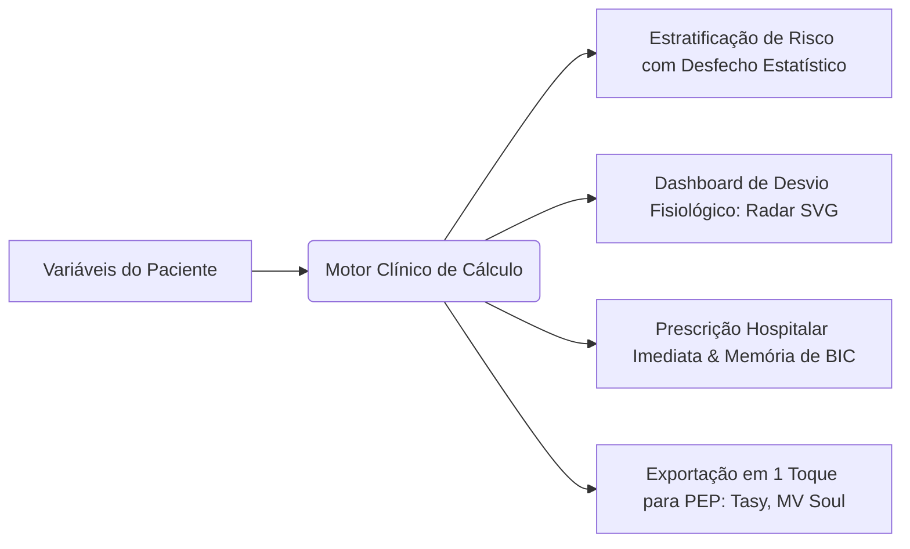

# 🩺 Scoreboard App — Clinical Decision Support System (CDSS)

[](https://github.com/melkidonadonmed-lgtm/scoreboard)
[](https://github.com/melkidonadonmed-lgtm/scoreboard)
[](https://github.com/melkidonadonmed-lgtm/scoreboard)
[](https://github.com/melkidonadonmed-lgtm/scoreboard)

> **Aviso de Segurança e Isenção Regulatória:** O **Scoreboard App** atua como ferramenta de suporte à decisão clínica informada (*Clinical Decision Support System - CDSS*), em estrita observância à **RDC ANVISA 657/2022** e aos pareceres do **Conselho Federal de Medicina (CFM)**. As pontuações, estratificações probabilísticas e minutas de condutas baseiam-se em diretrizes médicas públicas consensuadas (SBC, AMIB, SBPT, AHA, ESC, KDIGO) e têm caráter estritamente educacional e assistencial consultivo, não substituindo o exame físico presencial e o julgamento individualizado do médico assistente.

---

## 💡 A Ideia e Proposta de Valor

Na rotina médica sob estresse extremo (Salas Vermelhas, Prontos-Socorros, Enfermarias e UTIs), calculadoras tradicionais (como MDCalc e QxMD) funcionam como sistemas isolados e incompletos: recebem valores e retornam apenas um número ou uma categoria abstrata, abandonando o médico no momento crítico da conduta.

O **Scoreboard App** foi desenhado para eliminar essa fragmentação. Toda pontuação calculada é automaticamente traduzida em quatro dimensões imediatas:



1. **Estratificação Estatística Validada:** Desfechos empíricos concretos (ex.: probabilidade de mortalidade intra-hospitalar, risco de MACE em 6 semanas, risco de TEP).
2. **Dashboard de Desvio Fisiológico (Normal vs. Paciente):** Gráfico Radar multidimensional em SVG puro que compara a homeostase de um indivíduo sadio basal (polígono verde central) com a expansão patológica dos eixos do paciente em tempo real.
3. **Conduta Terapêutica Estruturada:** Fármacos de escolha com posologia de ataque e manutenção, vias, diluições hospitalares padronizadas, matriz de titulação de drogas vasoativas em BIC e ajustes obrigatórios por peso e função renal (ClCr).
4. **Cópia Instantânea para Prontuário Eletrônico (PEP):** Geração de texto pré-formatado para colagem direta em prontuários hospitalares (**MV Soul, Philips Tasy, Epimed, Pixeon**).

---

## 🎨 Design System: FrontCraft Master v2.0

Interface ergonômica projetada especificamente para uso com uma só mão em ambientes móveis críticos:

- **Operação One-Thumb:** Elementos de ação prioritária concentrados na metade inferior da tela, com Bottom Navigation de alvos táteis amplos ($\ge 48\times 48\text{px}$).
- **Física Tátil Realista:** Superfícies com chanfro físico superior de 1px (`shadow-bevel`) e sombras volumétricas em multicamada combinando sombra de oclusão e dispersão difusa.
- **Cores Semânticas de Alto Contraste Clínico (WCAG 2.1 AA/AAA):**
  - 🟢 **Verde (`#10B981`):** Estabilidade / Baixo Risco / Homeostase
  - 🟡 **Laranja/Âmbar (`#F59E0B`):** Alerta / Risco Intermediário
  - 🔴 **Vermelho (`#EF4444`):** Emergência / Alto Risco / Crítico
  - 🔵 **Superfície Cirúrgica (`#0F172A` / `#1E293B`):** Fundo escuro antirreflexo calibrado para reduzir fadiga visual em plantões noturnos.

---

## 🗂️ Taxonomia Completa: 9 Blocos e 20 Módulos Clínicos

O acervo cobre exaustivamente a medicina de emergência, terapia intensiva e clínica médica através de **20 módulos** organizados em **9 blocos**:

| Bloco | Módulo | Calculadoras e Escores Incluídos | Finalidade e Destaques Clínicos |
| :--- | :--- | :--- | :--- |
| **1. Emergência & UTI** | **Módulo 01:** Sepse e Choque | `qSOFA`, `SOFA`, `APACHE II`, `APACHE IV`, `SAPS 3` | Triagem rápida fora da UTI, disfunção multiorgânica seriada e predição de mortalidade. |
| | **Módulo 02:** Tromboembolismo Venoso | `Wells TVP`, `Wells TEP`, `Geneva Revisado`, `PERC`, `PESI`, `sPESI` | Estratificação pré-teste, indicação de D-Dímero/Angio-TC e risco em 30 dias. |
| | **Módulo 03:** Consciência & Sedação | `Glasgow-P`, `FOUR Score`, `RASS`, `SAS`, `CAM-ICU` | Reatividade pupilar, critérios de IOT protetora, titulação de sedação e triagem de delirium. |
| | **Módulo 04:** Pancreatite Aguda | `Critérios de Ranson`, `BISAP`, `Balthazar (TC)`, `Marshall Modificado` | Detecção precoce de necrose e falência orgânica com metas de ressuscitação volêmica. |
| **2. Cardiologia** | **Módulo 05:** Dor Torácica & SCA | `HEART Score`, `TIMI Risk (SCA)`, `GRACE 2.0`, `Killip-Kimball` | Estratificação de MACE em 6 semanas, indicação de CATE de emergência ($< 2\text{h}$) vs precoce ($< 24\text{h}$). |
| | **Módulo 06:** Fibrilação Atrial | `CHA2DS2-VASc`, `HAS-BLED`, `ATRIA` | Indicação mandatória de DOACs/Varfarina e controle de fatores reversíveis de sangramento. |
| | **Módulo 07:** Insuficiência Cardíaca | `Framingham`, `NYHA I-IV`, `MAGGIC Risk`, `Perfil de Stevenson (A/B/C/L)` | Diagnóstico clínico de ICC, prognóstico ambulatorial e manejo hemodinâmico de descompensação. |
| **3. Neurologia** | **Módulo 08:** AVC, TCE & Neurotrauma | `NIHSS`, `ASPECTS`, `ABCD2`, `ICH Score`, `Fisher / Fisher Modificada`, `Hunt-Hess`, `WFNS`, `Marshall`, `Rotterdam`, `ASIA (TRM)`, `mRS`, `EDSS` | Elegibilidade para trombólise química $\le 4,5\text{h}$ e trombectomia mecânica $\le 24\text{h}$, risco pós-AIT, prognóstico de HSA e incapacidade em EM. |
| **4. Pneumologia** | **Módulo 09:** Pneumonia Comunitária | `CURB-65`, `CRB-65`, `PSI/PORT Score`, `SMART-COP` | Decisão de alta vs enfermaria vs UTI imediata e antibioticoterapia empírica direcionada. |
| | **Módulo 10:** DPOC & Asma | `GOLD ABCD`, `Índice BODE`, `Escala de Dispneia mMRC`, `Wood-Downes Modificada` | Estadiamento funcional, risco de exacerbação grave e broncoespasmo pediátrico. |
| **5. Cirurgia & Trauma** | **Módulo 11:** Abdome Agudo | `Escore de Alvarado`, `RIPASA Score`, `Critérios de Tokyo (Colecistite/Colangite)` | Decisão cirúrgica na suspeita de apendicite e gravidade de sepse biliar. |
| | **Módulo 12:** Trauma & Queimaduras | `RTS`, `ISS`, `TRISS`, `Fórmula de Parkland (Grandes Queimados)` | Probabilidade de sobrevida no politrauma e reposição de cristaloides guiada por débito urinário. |
| | **Módulo 13:** Risco Cirúrgico | `Classificação ASA`, `Goldman`, `RCRI de Lee`, `Caprini` | Risco cardíaco em cirurgia não cardíaca e protocolo de profilaxia mecânica/farmacológica de TEV. |
| **6. Nefrologia** | **Módulo 14:** Injúria Renal & DRC | `KDIGO (Estágios 1-3)`, `AKIN`, `RIFLE`, `CKD-EPI 2021`, `Cockcroft-Gault` | Diagnóstico de LRA por creatinina/diurese e calculadora de conversão de doses de fármacos. |
| | **Módulo 15:** Eletrólitos & Ácido-Base | `Ânion Gap Sérico e Urinário`, `Delta Gap / Delta Ratio`, `Déficit de Água Livre`, `Sódio Corrigido pela Glicemia`, `Reposição de K⁺` | Diagnóstico etiológico de acidoses metabólicas e correção segura de hipo/hipernatremia. |
| **7. Hepatologia** | **Módulo 16:** Doença Hepática & MELD | `Child-Pugh (A/B/C)`, `MELD`, `MELD-Na`, `Função Discriminante de Maddrey` | Gravidade da cirrose, alocação em fila de transplante e indicação de corticoterapia na hepatite alcoólica. |
| | **Módulo 17:** Hemorragia Digestiva | `Glasgow-Blatchford`, `Rockall Score`, `AIMS65` | Triagem de pacientes de baixo risco para alta precoce e identificação de hemorragia digestiva maciça. |
| **8. Pediatria** | **Módulo 18:** Neonatologia | `Apgar (1º e 5º min)`, `Silverman-Andersen`, `Ballard / Capurro`, `Zonas de Kramer` | Reanimação em sala de parto, desconforto respiratório neonatal e avaliação de icterícia. |
| | **Módulo 19:** Emergência Pediátrica | `PEWS`, `Glasgow Pediátrico`, `PELOD-2`, `Regra de Holliday-Segar` | Detecção precoce de parada cardiorrespiratória em enfermaria e hidratação venosa de manutenção. |
| **9. Hematologia** | **Módulo 20:** Anemias & Coagulação | `Índice de Mentzer`, `Escore 4Ts para HIT`, `Escore de CIVD da ISTH`, `ISTH-BAT` | Diferenciação entre talassemia menor e anemia ferropriva, manejo imediato de plaquetopenia por heparina. |

---

## ⚡ Guia de Infusão Contínua (BIC) e Drogas Vasoativas

O sistema inclui motor de cálculo físico para bomba de infusão contínua:

$$\text{Velocidade de Infusão (mL/h)} = \frac{\text{Dose Prescrita } (\mu\text{g/kg/min}) \times \text{Peso do Paciente } (\text{kg}) \times 60\text{ min}}{\text{Concentração da Solução } (\mu\text{g/mL})}$$

### Fármacos Padronizados com Memória de Cálculo Automática:
- **Noradrenalina:** Solução padrão de $16\text{ mg}$ em $234\text{ mL}$ SG 5% ($64\ \mu\text{g/mL}$). Alvo de titulação: PAM $\ge 65\text{ mmHg}$ via acesso central.
- **Vasopressina:** $20\text{ UI}$ em $99\text{ mL}$ ($0,2\text{ UI/mL}$). Dose fixa poupadora no choque séptico ($0,01-0,04\text{ UI/min}$).
- **Dobutamina:** $250\text{ mg}$ em $230\text{ mL}$ SG 5% ($1.000\ \mu\text{g/mL}$) para suporte inotrópico no choque cardiogênico.
- **Nitroglicerina (Tridil):** $50\text{ mg}$ em $240\text{ mL}$ SG 5% ($200\ \mu\text{g/mL}$) com frasco de vidro/polietileno.

---

## 🗺️ Estrutura do Repositório

```
scoreboard/
├── docs/                                 # Base Documental e Especificações Médicas
│   ├── 00_proposta_e_arquitetura/        # Proposta Técnica SaMD e Plano de Execução
│   ├── 01_especificacoes_clinicas/       # 9 Guias em PDF, Dossiês e Matriz dos 20 Módulos
│   ├── 02_design_system_ui/              # Laboratório FrontCraft Master v2.0 e Tokens
│   ├── 03_protocolos_prescricao_bic/     # Protocolos de Drogas Vasoativas e Condutas UTI
│   ├── _bruto_original/                  # Backup íntegro dos arquivos de origem
│   └── INDEX.md                          # Sumário Geral de Documentos
├── scripts/                              # Automações de Engenharia e Testes
│   └── ingest_clinical_data.py           # Pipeline de extração e validação do catálogo
├── src/                                  # Código-Fonte do PWA Mobile-First
│   ├── components/                       # Componentes React (Radar SVG, Prescrição, Modais)
│   ├── data/                             # clinical_scores.json (Catálogo tipado Zod)
│   ├── services/                         # Motores de Cálculo, Infusão BIC e Storage IndexedDB
│   └── types/                            # Tipagens estritas TypeScript para os escores
├── tests/                                # Testes Unitários e Validação de Contrato Clínico
├── package.json                          # Dependências Vite, React, Tailwind, Lucide, IdB
├── tailwind.config.js                    # Tokens táteis do FrontCraft Master v2.0
└── README.md                             # Documento de Apresentação e Arquitetura
```

---

## 🚀 Roadmap e Fases de Implementação

O projeto segue um fluxo determinístico em **4 Fases**:

- [x] **Fase 0: Alinhamento, Pesquisa e Padronização Documental**
  - Mapeamento e estruturação de 100% dos documentos clínicos e técnicos em `docs/`.
  - Elaboração da [Proposta Técnica e Arquitetural Atualizada](file:///home/melki/projects/workspace/projects/scoreboard-app/docs/00_proposta_e_arquitetura/PROPOSTA_TECNICA_E_ARQUITETURAL_ATUALIZADA.md).
  - Publicação da [Matriz de 20 Módulos Clínicos](file:///home/melki/projects/workspace/projects/scoreboard-app/docs/01_especificacoes_clinicas/MATRIZ_TAXONOMIA_20_MODULOS.md).
  - Inicialização do repositório Git e vinculação ao GitHub (`main`).
- [ ] **Fase 1: Setup do PWA Mobile-First e Ingestão Automatizada de Dados**
  - Inicialização do ambiente Vite + React 18/19 + TypeScript + Tailwind CSS.
  - Configuração do manifesto PWA e Service Worker para cache offline imediato.
  - Execução de `scripts/ingest_clinical_data.py` gerando `src/data/clinical_scores.json`.
- [ ] **Fase 2: Motores de Cálculo Clínico e Componentes Visuais (Radar SVG)**
  - Implementação do motor desacoplado (aditivo, contínuo e árvore de decisão).
  - Gráfico Radar Multidimensional em SVG matemático puro reativo a 60fps.
  - Barra linear de desvio fisiológico com marcadores duplos.
- [ ] **Fase 3: Telas Clínicas, Prescrição Médica e Calculadora de BIC**
  - Navegador hierárquico por especialidade (9 blocos / 20 módulos).
  - Formulário com validação de limites biológicos e preenchimento ágil.
  - Card de prescrição hospitalar com dosagens, ajustes renais e botão "Copiar para PEP".
- [ ] **Fase 4: Modo Meus Leitos (IndexedDB), Suíte de Testes e Homologação**
  - Armazenamento anônimo local de leitos no IndexedDB (Zero LGPD risk).
  - Pipeline de testes determinísticos de integridade matemática e contrato clínico.
  - Verificação final de acessibilidade WCAG 2.1 e auditoria offline.

---

## 🛡️ Segurança e Privacidade (Privacy-by-Design)

- **Zero Coleta de Dados Pessoais:** O Scoreboard App não transmite, não processa e não armazena nomes, CPFs, números de prontuário ou qualquer identificador individual de pacientes em servidores externos.
- **Armazenamento Volátil e Local:** As variáveis preenchidas permanecem exclusivamente na memória volátil de execução da aba ou, se expressamente acionado pelo médico, em contêiner local criptografado no navegador (IndexedDB) sob identificação anônima de leito.

---

## 📄 Licença e Propriedade

Desenvolvido para uso clínico e educacional de suporte à assistência hospitalar. Todos os direitos reservados.
