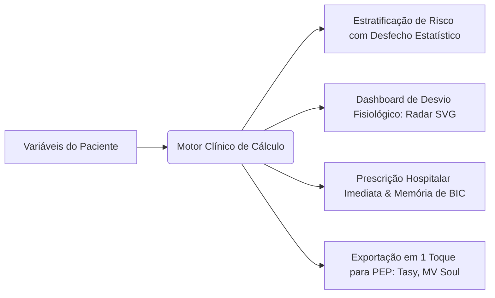

# 🩺 Scoreboard App — Clinical Decision Support System (CDSS)

[](https://github.com/melkidonadonmed-lgtm/scoreboard)
[](https://github.com/melkidonadonmed-lgtm/scoreboard)
[](https://github.com/melkidonadonmed-lgtm/scoreboard)
[](https://github.com/melkidonadonmed-lgtm/scoreboard)

> **Aviso de Segurança e Isenção Regulatória:** O **Scoreboard App** atua como ferramenta de apoio e suporte à decisão clínica informada (*Clinical Decision Support System - CDSS*), em estrita observância à **RDC ANVISA 657/2022** e aos pareceres do **Conselho Federal de Medicina (CFM)**. As pontuações, estratificações probabilísticas e minutas de condutas baseiam-se em diretrizes médicas públicas consensuadas (AMIB, SBC, SBPT, AHA, ESC, KDIGO) e têm caráter estritamente educacional e assistencial consultivo, não substituindo o exame físico presencial e o julgamento individualizado do médico assistente.

---

## 💡 A Ideia e Proposta de Valor

Na rotina médica sob estresse extremo (Salas Vermelhas, Prontos-Socorros, Enfermarias e UTIs), calculadoras tradicionais (como MDCalc e QxMD) funcionam como sistemas isolados e incompletos: recebem valores e retornam apenas um número ou uma categoria abstrata, abandonando o médico no momento crítico da conduta.

O **Scoreboard App** foi desenhado para eliminar essa fragmentação. Toda pontuação calculada é automaticamente traduzida em quatro dimensões imediatas:



1. **Estratificação Estatística Validada:** Desfechos empíricos concretos (ex.: probabilidade de mortalidade intra-hospitalar, risco de MACE em 6 semanas, risco de TEP).
2. **Dashboard de Desvio Fisiológico (Normal vs. Paciente):** Gráfico Radar multidimensional em SVG puro a 60fps que compara a homeostase de um indivíduo sadio basal (polígono verde central) com a expansão patológica dos eixos do paciente em tempo real.
3. **Conduta Terapêutica Estruturada:** Fármacos de escolha com posologia de ataque e manutenção, vias, diluições hospitalares padronizadas, matriz de titulação de drogas vasoativas em BIC e ajustes obrigatórios por peso e função renal (ClCr).
4. **Cópia Instantânea para Prontuário Eletrônico (PEP):** Geração de texto pré-formatado (SOAP/SBAR) para colagem direta em prontuários hospitalares (**MV Soul, Philips Tasy, Epimed, Pixeon**).

---

## 🎨 Design System: FrontCraft Master v2.0

Interface ergonômica projetada especificamente para uso com uma só mão em ambientes móveis críticos:

- **Modo Score Avulso & Isolado:** Liberdade total para selecionar qualquer calculadora isoladamente (ex.: preencher apenas o HEART Score ou apenas o Clearance de Cockcroft-Gault), sem obrigatoriedade de percorrer formulários longos ou baterias complexas.
- **Favoritos do Dia a Dia (Quick-Pins ⭐):** O médico pode favoritar com uma estrela os escores mais frequentes do seu plantão (ex.: SOFA na UTI, HEART na emergência, CURB-65 na enfermaria), deixando-os fixados no topo da tela inicial para abertura em 1 toque. Salvos localmente no dispositivo (IndexedDB).
- **Operação One-Thumb:** Elementos de ação prioritária concentrados na metade inferior da tela, com Bottom Navigation de alvos táteis amplos ($\ge 48\times 48\text{px}$).
- **Física Tátil Realista:** Superfícies com chanfro físico superior de 1px (`shadow-bevel`) e sombras volumétricas em multicamada combinando sombra de oclusão e dispersão difusa.
- **Cores Semânticas de Alto Contraste Clínico (WCAG 2.1 AA/AAA):**
  - 🟢 **Verde (`#10B981`):** Estabilidade / Baixo Risco / Homeostase
  - 🟡 **Laranja/Âmbar (`#F59E0B`):** Alerta / Risco Intermediário
  - 🔴 **Vermelho (`#EF4444`):** Emergência / Alto Risco / Crítico
  - 🔵 **Superfície Cirúrgica (`#0F172A` / `#1E293B`):** Fundo escuro antirreflexo calibrado para reduzir fadiga visual em plantões noturnos.

---

## 🗂️ Taxonomia Completa: 9 Blocos, 20 Módulos e 98 Dossiês Monográficos

O acervo cobre exaustivamente a medicina de emergência, terapia intensiva e clínica médica através de **98 dossiês clínicos monográficos estruturados** (~102 calculadoras independentes considerando ferramentas combinadas):

| Bloco | Módulo | Calculadoras e Escores Incluídos | Finalidade e Destaques Clínicos Vigentes |
| :--- | :--- | :--- | :--- |
| **1. Emergência & Choque (19 Dossiês)** | **Módulo 01:** Sepse e Choque | `qSOFA`, `SOFA`, `APACHE II`, `SAPS 3` | Triagem rápida fora da UTI (*aviso SSC 2021: não usar qSOFA isolado para exclusão*), disfunção orgânica seriada ($\Delta\text{SOFA} \ge 2$) e predição de mortalidade. |
| | **Módulo 02:** Tromboembolismo Venoso | `Wells TVP`, `Wells TEP`, `Geneva Revisado`, `PERC`, `PESI`, `sPESI` | Estratificação pré-teste, indicação de D-Dímero/Angio-TC e risco em 30 dias. |
| | **Módulo 03:** Consciência & Sedação | `Glasgow-P`, `FOUR Score`, `RASS`, `SAS`, `CAM-ICU` | Reatividade pupilar, critérios de IOT protetora, titulação de sedação e triagem de delirium. |
| | **Módulo 04:** Pancreatite Aguda | `Critérios de Ranson`, `BISAP`, `Balthazar CTSI`, `Marshall Modificado` | Detecção precoce de necrose e falência orgânica com metas de ressuscitação volêmica. |
| **2. Cardiologia (12 Dossiês)** | **Módulo 05:** Dor Torácica & SCA | `HEART Score`, `TIMI IAMSSST`, `GRACE 2.0`, `Killip-Kimball` | Estratificação de MACE em 6 semanas, indicação de CATE de emergência ($< 2\text{h}$) vs precoce ($< 24\text{h}$). |
| | **Módulo 06:** Fibrilação Atrial | `CHA2DS2-VASc`, `HAS-BLED`, `ATRIA`, `HEMORR2HAGES` | Indicação mandatória de DOACs/Varfarina e controle de fatores reversíveis de sangramento. |
| | **Módulo 07:** Insuficiência Cardíaca | `Framingham`, `NYHA I-IV`, `Estadiamento ACC/AHA`, `MAGGIC Risk` | Diagnóstico clínico de ICC, prognóstico ambulatorial e manejo hemodinâmico de descompensação. |
| **3. Neurologia (16 Dossiês)** | **Módulo 08:** AVC, TCE & Neurotrauma | `NIHSS`, `ASPECTS`, `ABCD2`, `ICH Score`, `Hunt-Hess`, `WFNS`, `Fisher / Fisher Modificada`, `Spetzler-Martin`, `Marshall TCE`, `Rotterdam`, `ASIA/AIS`, `KPS`, `mRS`, `MEEM / MoCA`, `Hoehn & Yahr`, `EDSS` | Elegibilidade para trombólise química ($\le 4,5\text{h}$) e trombectomia mecânica ($\le 24\text{h}$), risco pós-AIT, prognóstico de HSA e incapacidade neurológica. |
| **4. Pneumologia (8 Dossiês)** | **Módulo 09:** Pneumonia Comunitária | `CURB-65`, `CRB-65`, `PSI/PORT Score`, `SMART-COP` | Decisão de alta vs enfermaria vs UTI imediata e antibioticoterapia empírica direcionada. |
| | **Módulo 10:** DPOC & Asma | `Classificação GOLD ABE`, `Índice BODE`, `Escala de Dispneia mMRC`, `Wood-Downes Modificada` | Estadiamento funcional moderno GOLD ABE (2024/2025), risco de exacerbação grave e broncoespasmo pediátrico. |
| **5. Cirurgia & Trauma (12 Dossiês)** | **Módulo 11:** Abdome Agudo | `Escore de Alvarado (MANTRELS)`, `RIPASA Score`, `Critérios Tokyo TG18 (Colecistite/Colangite)` | Decisão cirúrgica na suspeita de apendicite e estratificação de gravidade de sepse biliar. |
| | **Módulo 12:** Trauma & Queimaduras | `RTS`, `ISS`, `TRISS`, `Diretriz ABA Moderna / Fórmula de Parkland` | Sobrevida no politrauma e ressuscitação volêmica ($2\text{ mL/kg/% SCQ}$ padrão ABA; $4\text{ mL}$ para trauma elétrico). |
| | **Módulo 13:** Risco Cirúrgico & TEV | `Classificação ASA`, `Goldman`, `RCRI de Lee`, `Caprini (2005)` | Risco cardíaco perioperatório e profilaxia mecânica/farmacológica individualizada de TEV. |
| **6. Nefrologia (11 Dossiês)** | **Módulo 14:** LRA & DRC | `KDIGO LRA`, `AKIN`, `RIFLE`, `CKD-EPI 2021 (sem raça)`, `Cockcroft-Gault`, `MDRD` | Diagnóstico de LRA por creatinina/diurese, taxa de filtração glomerular e ajuste posológico. |
| | **Módulo 15:** Eletrólitos & Ácido-Base | `Ânion Gap Sérico e Urinário`, `Delta Gap / Delta Ratio`, `Déficit de Água Livre`, `Sódio Corrigido (Katz/Hillier)`, `Reposição de K⁺` | Diagnóstico de distúrbios mistos do equilíbrio ácido-base e correção de sódio/potássio. |
| **7. Hepatologia (8 Dossiês)** | **Módulo 16:** Doença Hepática & MELD | `Child-Pugh (A/B/C)`, `MELD Original`, `MELD-Na (Padrão Brasil/SUS)`, `MELD 3.0`, `Maddrey mDF` | Gravidade da cirrose, priorização em fila de transplante hepático e corticoterapia na hepatite alcoólica. |
| | **Módulo 17:** Hemorragia Digestiva | `Glasgow-Blatchford`, `Rockall Score`, `AIMS65`, `Oakland Score` | Triagem de baixo risco para alta precoce e predição de hemorragia digestiva maciça e ressangramento. |
| **8. Pediatria (9 Dossiês)** | **Módulo 18:** Neonatologia & Parto | `Apgar (1º e 5º min)`, `Silverman-Andersen`, `Novo Ballard`, `Capurro (A e B)`, `Zonas de Kramer` | Reanimação neonatal em sala de parto, idade gestacional e avaliação topográfica de icterícia. |
| | **Módulo 19:** Emergência Pediátrica | `PEWS`, `Glasgow Pediátrico`, `PELOD-2`, `Regra de Holliday-Segar` | Detecção precoce de deterioração clínica em enfermaria e reposição hidroeletrolítica de manutenção. |
| **9. Hematologia (3 Dossiês)** | **Módulo 20:** Anemias & Hemostasia | `Índice de Mentzer`, `Critérios de CIVD da ISTH`, `Escore 4Ts para HIT` | Diagnóstico diferencial de microcitose (talassemia vs ferropenia), coagulopatia de consumo e plaquetopenia induzida por heparina. |

---

## ⚡ Guia de Infusão Contínua (BIC) e Farmacotécnica Hospitalar

O aplicativo conta com motor matemático puro (`infusionEngine.ts`) para cálculo físico de vazão em bomba de infusão contínua:

$$\text{Velocidade de Infusão (mL/h)} = \frac{\text{Dose Prescrita } (\mu\text{g/kg/min}) \times \text{Peso do Paciente } (\text{kg}) \times 60\text{ min}}{\text{Concentração da Solução } (\mu\text{g/mL})}$$

### Fármacos Padronizados com Protocolos AMIB / Farmácia Hospitalar:
- **Noradrenalina:** Solução padrão de $16\text{ mg}$ (4 ampolas) em $234\text{ mL}$ SG 5% ($64\ \mu\text{g/mL}$). Diluição mandatória em SG 5% (pH ácido 3.5–5.0 protege contra oxidação rápida). Alvo: PAM $\ge 65\text{ mmHg}$ via acesso central.
- **Vasopressina:** $20\text{ UI}$ em $99\text{ mL}$ SF 0,9% ou SG 5% ($0,2\text{ UI/mL}$). Dose fixa no choque séptico ($0,01\text{ a }0,04\text{ UI/min}$, equivalente a $3\text{ a }12\text{ mL/h}$ em BIC), iniciada se noradrenalina $> 0,25\ \mu\text{g/kg/min}$.
- **Dobutamina:** $250\text{ mg}$ em $230\text{ mL}$ SG 5% ($1.000\ \mu\text{g/mL}$) para suporte inotrópico no choque cardiogênico.
- **Nitroglicerina (Tridil):** $50\text{ mg}$ em $240\text{ mL}$ SG 5% ($200\ \mu\text{g/mL}$). Exige obrigatoriamente frasco de vidro ou polietileno/poliolefina (adsorve no PVC comum).

---

## 🗺️ Estrutura do Repositório

```
scoreboard/
├── docs/                                  # Base Documental e Especificações Médicas
│   ├── 00_plano_e_arquitetura/            # Plano Diretor, Técnico e Arquitetural SaMD
│   │   ├── PLANO_TECNICO_E_ARQUITETURAL_ATUALIZADO.md
│   │   └── Proposta_Original_Calculadoras_Medicas.pdf
│   ├── 01_especificacoes_clinicas/        # 9 Guias em PDF, 2 DOCX e Matriz dos 20 Módulos
│   │   ├── Bloco_01 a Bloco_09 (.pdf e .docx)
│   │   └── MATRIZ_TAXONOMIA_20_MODULOS.md
│   ├── 02_design_system_ui/               # Laboratório FrontCraft Master v2.0 e Tokens Táteis
│   │   ├── frontcraft_master_v2_0_estudio_reativo.html
│   │   ├── componente_tokens_frontcraft.ts
│   │   └── especificacao_design_system_tokens.md
│   ├── 03_protocolos_prescricao_bic/      # Protocolos de Infusão e Drogas Vasoativas
│   ├── _bruto_original/                   # Backup íntegro dos arquivos de origem
│   └── INDEX.md                           # Índice Geral de Documentação Técnica
├── scripts/                               # Automações de Engenharia e Ingestão de Dados
│   ├── ingest_catalog.py                  # Extrator determinístico dos 98 dossiês para JSON modular
│   └── validate_catalog.ts                # Validador estrito via Zod dos schemas gerados
├── src/                                   # Código-Fonte do PWA Mobile-First
│   ├── components/                        # Componentes React (FrontCraft Master v2.0)
│   │   ├── common/                        # Botões táteis, Badges WCAG, Inputs numéricos
│   │   ├── layout/                        # AppHeader com busca rápida, BottomNav One-Thumb
│   │   ├── navigation/                    # SpecialtyBrowser, QuickPinsBar (⭐ Favoritos)
│   │   ├── calculator/                    # CalculatorHost, AdditiveScoreForm, ContinuousScoreForm
│   │   ├── visualizer/                    # PhysiologicalRadar (SVG 60fps), SeverityGradientBar
│   │   ├── prescription/                  # PrescriptionCard, BicModal (Vazão mL/h), PepExportButton
│   │   └── beds/                          # BedsManager, AnonymousBedCard
│   ├── data/                              # Catálogo Clínico Modular (Lazy Loading por Bloco)
│   │   ├── blocks/                        # block_01.json até block_09.json
│   │   ├── vasoactive_drugs.json          # Farmacotécnica de infusão para BIC
│   │   └── index.ts                       # Manifest leve de busca (~30KB) e lazy loader
│   ├── engines/                           # Motores Clínicos Puros (Zero dependência de UI / 100% Testáveis)
│   │   ├── calculationEngine.ts           # Despachante dos cálculos aditivos, fórmulas e árvores
│   │   ├── infusionEngine.ts              # Cálculo físico de vazão de BIC e titulação
│   │   ├── radarEngine.ts                 # Normalização polar e projeção geométrica SVG
│   │   └── pepExportEngine.ts             # Formatador de laudos SOAP/SBAR para MV Soul e Tasy
│   ├── services/                          # Serviços de Persistência e Sistema
│   │   ├── storageService.ts              # IndexedDB nativo (leitos e favoritos locais via idb)
│   │   └── contrastEngine.ts              # Auditoria WCAG 2.1 e luminância relativa
│   ├── types/                             # Contratos TypeScript & Schemas Zod
│   │   ├── clinical.ts                    # Calculator, ParameterGroup, RiskTier, ClinicalAction
│   │   ├── infusion.ts                    # InfusionProtocol, DrugConcentration, BicParameters
│   │   └── bed.ts                         # AnonymousBed, BedRecord
│   ├── hooks/                             # Hooks Customizados (useCalculator, useQuickPins, useBic)
│   ├── styles/                            # Tokens táteis, shadow-bevel e safe-area
│   ├── App.tsx                            # Orquestrador de Telas
│   └── main.tsx                           # Ponto de Entrada com Registro do Service Worker
├── tests/                                 # Suíte Determinística de Testes (Vitest)
│   ├── unit/                              # Testes matemáticos dos motores clínicos e de infusão
│   └── contract/                          # Validação Zod de 100% dos 98 escores dos JSONs
├── package.json                           # React 18/19, Vite, TypeScript, Tailwind, Lucide, idb, zod
├── tsconfig.json                          # Strict Mode ativado
├── vite.config.ts                         # Plugin PWA (Workbox Cache-First offline)
├── tailwind.config.js                     # Configuração calibrada de tokens FrontCraft
└── README.md                              # Apresentação Geral e Arquitetura do Projeto
```

---

## 🚀 Roadmap e Fases de Implementação

O projeto segue um fluxo determinístico em **4 Fases**:

- [x] **Fase 0: Auditoria Crítica, Padronização Documental e Plano Diretor**
  - Auditoria e censo real dos 98 dossiês clínicos monográficos estruturados nos 9 PDFs.
  - Recuperação do Seed JSON original do HEART Score para modelagem Zod.
  - Atualização do [Plano Diretor, Técnico e Arquitetural](file:///home/melki/projects/workspace/projects/scoreboard-app/docs/00_plano_e_arquitetura/PLANO_TECNICO_E_ARQUITETURAL_ATUALIZADO.md).
  - Publicação da [Matriz de 20 Módulos Clínicos](file:///home/melki/projects/workspace/projects/scoreboard-app/docs/01_especificacoes_clinicas/MATRIZ_TAXONOMIA_20_MODULOS.md).
  - Configuração do repositório Git e vinculação ao GitHub (`main`).
- [ ] **Fase 1: Setup do PWA Mobile-First e Ingestão Modular de Dados**
  - Inicialização do ambiente Vite + React + TypeScript + Tailwind CSS.
  - Definição dos schemas Zod em `src/types/clinical.ts`.
  - Execução de `scripts/ingest_catalog.py` gerando os 9 arquivos modulares em `src/data/blocks/`.
  - Validação contratual Zod com `scripts/validate_catalog.ts`.
- [ ] **Fase 2: Motores Puros de Cálculo Matemático e Radar SVG 60fps**
  - Implementação de `calculationEngine.ts` cobrindo modelos aditivos, contínuos e árvores decisórias.
  - Implementação de `infusionEngine.ts` com a fórmula exata de BIC e titulação de drogas vasoativas.
  - Construção do componente `PhysiologicalRadar.tsx` em SVG nativo reativo a 60fps.
  - Testes unitários com casos clínicos de controle conhecidos no Vitest.
- [ ] **Fase 3: Telas Clínicas, Prescrição Médica e Integração com PEP**
  - Navegador hierárquico por especialidade (9 blocos / 20 módulos) e Quick-Pins ⭐.
  - Formulário ágil com validação de limites biológicos.
  - Card de prescrição hospitalar com dosagens, diluições de BIC, condutas não farmacológicas e botão "Copiar para PEP" (SOAP/SBAR).
- [ ] **Fase 4: Modo Meus Leitos (IndexedDB), Service Worker PWA e Homologação**
  - Armazenamento 100% local e anônimo no IndexedDB (Zero LGPD risk).
  - Configuração do Service Worker offline com estratégia *Cache-First*.
  - Auditoria de acessibilidade WCAG 2.1 AA/AAA sob iluminação hospitalar.
  - Relatório final de homologação técnica e de conformidade SaMD (RDC ANVISA 657/2022).

---

## 🛡️ Segurança, Conformidade Regulatória e Privacidade (Privacy-by-Design)

- **Zero Coleta de Dados Pessoais:** O Scoreboard App não transmite, não processa e não armazena nomes, CPFs, números de prontuário ou qualquer identificador individual de pacientes em servidores externos.
- **Armazenamento Volátil e Local:** As variáveis preenchidas permanecem exclusivamente na memória volátil de execução da aba ou, se expressamente acionado pelo médico, em contêiner local no navegador (IndexedDB) sob identificação anônima de leito ("Leito 04 - UTI").
- **Conformidade ANVISA:** Classificado como software de suporte à decisão clínica informativa, fornecendo a justificativa fisiológica, a equação e a fonte bibliográfica primária para cada recomendação gerada.
