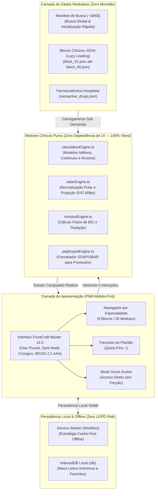
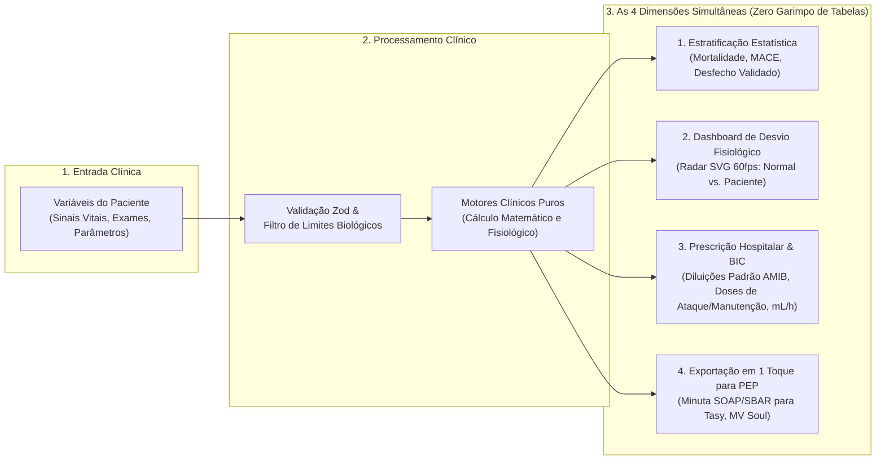
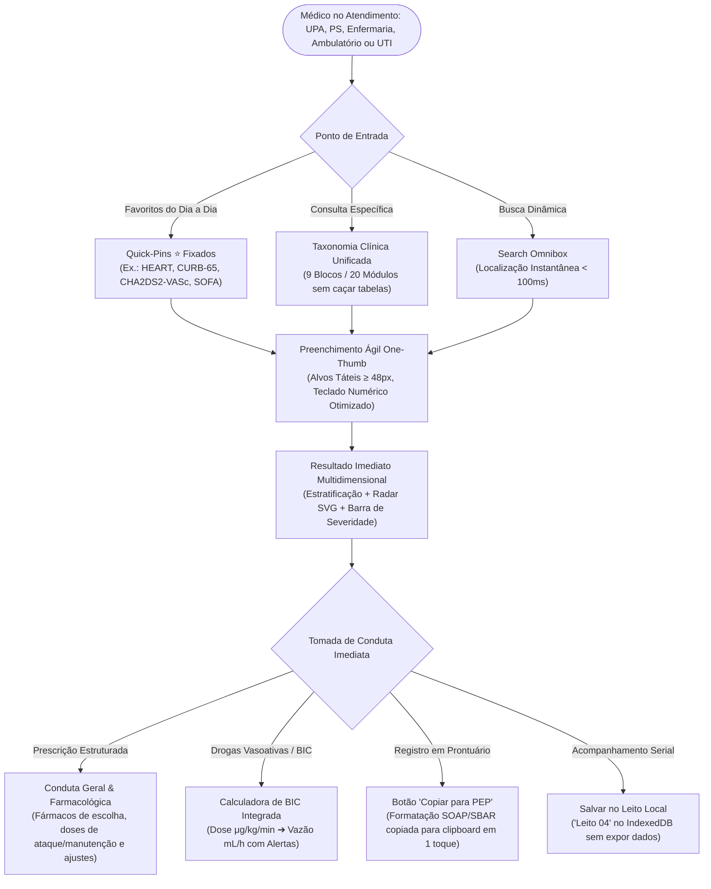

# 🩺 Scoreboard App — Clinical Decision Support System (CDSS)

[](https://github.com/melkidonadonmed-lgtm/scoreboard)
[](https://github.com/melkidonadonmed-lgtm/scoreboard)
[](https://github.com/melkidonadonmed-lgtm/scoreboard)
[](https://github.com/melkidonadonmed-lgtm/scoreboard)
[](https://github.com/melkidonadonmed-lgtm/scoreboard)
[](https://github.com/melkidonadonmed-lgtm/scoreboard)

> [!IMPORTANT]
> **Aviso Regulatório e Isenção de Responsabilidade Médica (SaMD):**
> O **Scoreboard App** atua estritamente como sistema de apoio e suporte à decisão clínica informada (*Clinical Decision Support System - CDSS*), em conformidade com a **RDC ANVISA nº 657/2022** e com os pareceres do **Conselho Federal de Medicina (CFM)**. As pontuações, probabilidades estatísticas e minutas de condutas baseiam-se em diretrizes médicas públicas consensuadas (AMIB, SBC, SBPT, AHA, ESC, KDIGO) e têm finalidade exclusivamente consultiva e educacional. O aplicativo **não substitui** o exame físico presencial, a anamnese detalhada e o julgamento soberano e individualizado do médico assistente.

---

## 💡 Visão Geral e Proposta de Valor: Feito para Qualquer Médico

### 🩺 Democratização da Decisão Clínica: Da Atenção Básica e UPA à Terapia Intensiva

O **Scoreboard App** **não foi feito apenas para médicos intensivistas**. Ele foi desenhado para facilitar e transformar a prática diária de **qualquer médico**, em qualquer nível de atenção:

- **Médicos Generalistas e Recém-formados em UPAs e Prontos-Atendimentos:** Segurança diagnóstica imediata para saber se o paciente pode ter alta assistida com receita na mão ou se necessita de internação/vaga de emergência (ex.: HEART Score, CURB-65, Wells, Alvarado).
- **Médicos Residentes e Hospitalistas em Enfermarias Clínicas e Cirúrgicas:** Acompanhamento rápido da evolução diária, estratificação de gravidade (SOFA, Ranson, Child-Pugh), ajuste posológico de antimicrobianos pelo clearance renal (CKD-EPI / Cockcroft-Gault) e prevenção de deterioração clínica.
- **Médicos Ambulatoriais e de Medicina de Família:** Decisões terapêuticas rápidas sem perda de tempo com busca manual — ex.: decidir anticoagulação plena na Fibrilação Atrial balanceando risco isquêmico e hemorrágico (`CHA2DS2-VASc` vs. `HAS-BLED`), estadiamento do DPOC (`GOLD ABE 2024/2025`) ou estratificação de Insuficiência Cardíaca (`MAGGIC`).
- **Cirurgiões e Anestesiologistas:** Avaliação ágil de risco cardiovascular pré-operatório (`RCRI de Lee`, `Goldman`, `ASA`) e profilaxia individualizada mecânica e química de TEV (`Caprini`).
- **Emergencistas e Intensivistas:** Condução avançada de choque séptico, falência orgânica seriada, ressuscitação volêmica guiada em queimados e titulação fina de drogas vasoativas em Bomba de Infusão Contínua (BIC).

---

### 🚫 O Fim do "Garimpo de Tabelas": Hub Prático de Condutas em Tempo Real

Na rotina médica sob estresse e sobrecarga de atendimentos, calculadoras médicas tradicionais (como MDCalc e QxMD) funcionam de forma isolada e incompleta: recebem números e retornam apenas uma pontuação abstrata ("Pontuação: 4 - Risco Intermediário"), **abandonando o médico justamente no momento mais decisivo da conduta**.

Para fechar o atendimento, o profissional é obrigado a:
1. Interromper o raciocínio clínico para garimpar diretrizes em PDFs no celular;
2. Pesquisar tabela por tabela na internet para encontrar doses pediátricas/adulto;
3. Buscar em outra fonte a diluição correta, a via de infusão e os ajustes por função renal.

O **Scoreboard App elimina esse retrabalho**. Em vez de garimpar tabelas dispersas, o médico dispõe de uma **fonte prática, centralizada e rigorosamente atualizada de condutas gerais baseadas em scores e calculadoras**:

```
[Variáveis do Paciente] ➔ [Cálculo Instantâneo] ➔ [Conduta Terapêutica Completa na Mesma Tela]
```

Toda pontuação calculada traduz-se automaticamente em **quatro dimensões clínicas simultâneas**:

1. **Estratificação Estatística Validada:** Desfechos empíricos concretos baseados na literatura (ex.: mortalidade intra-hospitalar em 28 dias, risco de MACE em 6 semanas, probabilidade pré-teste de TEP/TVP).
2. **Dashboard de Desvio Fisiológico (Normal vs. Paciente):** Gráfico Radar multidimensional em SVG puro a 60fps, contrastando a homeostase basal de um indivíduo saudável (polígono verde central) com a distorção patológica dos eixos do paciente.
3. **Conduta Terapêutica Estruturada (Sem Garimpar Tabelas):** Fármacos de primeira linha com doses de ataque e manutenção, diluições hospitalares padronizadas, matriz de titulação de drogas vasoativas em Bomba de Infusão Contínua (BIC) e ajustes mandatários por peso e função renal (ClCr).
4. **Exportação Instantânea para PEP (1 Toque):** Minuta clínica estruturada no modelo SOAP/SBAR pronta para cópia e colagem nos principais Prontuários Eletrônicos do Paciente (**Philips Tasy, MV Soul, Epimed, Pixeon**).

---

## 🏛️ Arquitetura do Sistema e Engenharia de Dados

O Scoreboard App adota uma arquitetura modular desacoplada (*Zero Monolith*), projetada para garantir inicialização instantânea (<100ms) mesmo em conexões hospitalares lentas ou nulas.

### Diagrama 1: Arquitetura em Camadas e Fluxo de Dados


### Diagrama 2: Pipeline Clínico-Decisório em 4 Dimensões


### Diagrama 3: Jornada de Qualquer Médico no Atendimento (Mobile One-Thumb)


---

## 🛡️ Pilares de Engenharia e Integridade Clínica

1. **Zero Monolito (Data-Chunking & Lazy Loading):**
   - Ao contrário de aplicações que empacotam dezenas de megabytes em um único bundle, o Scoreboard carrega inicialmente apenas um **Manifest de Busca Leve (~30KB)**.
   - Cada um dos 9 blocos clínicos (`block_01.json` a `block_09.json`) é importado assincronamente apenas quando o módulo correspondente é acessado pelo usuário.
2. **Motores Clínicos Puros (*Pure Computational Engines*):**
   - Todos os cálculos médicos, geométricos e farmacotécnicos residem em `src/engines/` como funções determinísticas puras em TypeScript, sem acoplamento com o ecossistema React/DOM.
   - Cobertura de 100% por testes unitários no Vitest com casos clínicos de controle.
3. **Zero Bloatware Visual (Radar SVG Nativo a 60fps):**
   - Eliminação de bibliotecas pesadas de gráficos (como Chart.js, D3 ou Recharts).
   - O componente `PhysiologicalRadar` gera marcações geométricas SVG em tempo de execução com transições aceleradas por GPU, mantendo taxa de quadros estável em dispositivos modestos.
4. **Privacidade Absoluta (Privacy-by-Design & Zero LGPD Risk):**
   - Nenhuma informação de saúde ou dado pessoal identificado (nome, CPF, CNS, prontuário) é solicitado, processado ou trafegado para servidores remotos.
   - O recurso "Meus Leitos" utiliza identificadores de leito provisórios e transitórios ("Leito 03 - UTI") gravados localmente no navegador do usuário via IndexedDB.

---

## 🎨 Design System: FrontCraft Master v2.0

Projetado especificamente para as condições reais de sobrecarga física e visual dos atendimentos — em UPAs, enfermarias, ambulatórios, centros cirúrgicos e plantões de UTI:

- **Modo Score Avulso & Isolado:** Acesso direto a qualquer calculadora sem a obrigação de preencher formulários longos ou baterias complexas.
- **Favoritos do Dia a Dia (Quick-Pins ⭐):** Fixação dos escores mais frequentes da rotina de cada profissional no topo da tela inicial para abertura em 1 toque (ex.: `HEART` no pronto-atendimento, `CHA2DS2-VASc` no ambulatório, `CURB-65` na enfermaria, `Caprini` no pré-op, `SOFA` na UTI), salvos localmente via IndexedDB.
- **Ergonomia One-Thumb:** Elementos de ação concentrados na metade inferior da tela do smartphone, com alvos de toque amplos ($\ge 48\times 48\text{px}$).
- **Física Tátil Realista:** Superfícies com chanfro físico superior de 1px (`shadow-bevel`) e sombras volumétricas em multicamada.
- **Cores Semânticas de Alto Contraste Clínico (Conformidade WCAG 2.1 AA/AAA):**
  - 🟢 **Verde (`#10B981`):** Estabilidade / Baixo Risco / Homeostase
  - 🟡 **Laranja/Âmbar (`#F59E0B`):** Alerta / Risco Intermediário
  - 🔴 **Vermelho (`#EF4444`):** Emergência / Alto Risco / Crítico
  - 🔵 **Superfície Cirúrgica (`#0F172A` / `#1E293B`):** Fundo escuro antirreflexo calibrado para reduzir fadiga visual em ambientes de penumbra.

---

## 🗂️ Taxonomia Completa: 9 Blocos, 20 Módulos e 98 Dossiês Monográficos

O catálogo clínico abrange integralmente a medicina de emergência, terapia intensiva e clínica médica através de **98 dossiês clínicos monográficos estruturados** (~102 calculadoras considerando subferramentas integradas):

| Bloco | Módulo | Calculadoras e Escores Incluídos | Finalidade e Diretrizes Médicas Vigentes |
| :--- | :--- | :--- | :--- |
| **1. Emergência & Choque (19 Dossiês)** | **Módulo 01:** Sepse e Choque | `qSOFA`, `SOFA`, `APACHE II`, `SAPS 3` | Triagem rápida fora da UTI (*aviso mandatório SSC 2021: não utilizar qSOFA isolado para exclusão de sepse*), disfunção orgânica seriada ($\Delta\text{SOFA} \ge 2$) e predição de mortalidade. |
| | **Módulo 02:** Tromboembolismo Venoso | `Wells TVP`, `Wells TEP`, `Geneva Revisado`, `PERC`, `PESI`, `sPESI` | Estratificação pré-teste, indicação de D-Dímero/Angio-TC de tórax e prognóstico em 30 dias. |
| | **Módulo 03:** Consciência & Sedação | `Glasgow-P`, `FOUR Score`, `RASS`, `SAS`, `CAM-ICU` | Reatividade pupilar, critérios de via aérea definitiva/IOT protetora, titulação de sedação e triagem de delirium. |
| | **Módulo 04:** Pancreatite Aguda | `Critérios de Ranson`, `BISAP`, `Balthazar CTSI`, `Marshall Modificado` | Detecção precoce de necrose pancreática e falência orgânica com metas de ressuscitação volêmica guiada. |
| **2. Cardiologia (12 Dossiês)** | **Módulo 05:** Dor Torácica & SCA | `HEART Score`, `TIMI IAMSSST`, `GRACE 2.0`, `Killip-Kimball` | Estratificação de MACE em 6 semanas, indicação de CATE de emergência ($< 2\text{h}$) vs precoce ($< 24\text{h}$). |
| | **Módulo 06:** Fibrilação Atrial | `CHA2DS2-VASc`, `HAS-BLED`, `ATRIA`, `HEMORR2HAGES` | Indicação de anticoagulação oral plena (DOACs/Varfarina) e controle de fatores reversíveis de sangramento. |
| | **Módulo 07:** Insuficiência Cardíaca | `Framingham`, `NYHA I-IV`, `Estadiamento ACC/AHA`, `MAGGIC Risk` | Critérios clínicos diagnósticos de ICC, estratificação funcional ambulatorial e manejo hemodinâmico de descompensação aguda. |
| **3. Neurologia (16 Dossiês)** | **Módulo 08:** AVC, TCE & Neurotrauma | `NIHSS`, `ASPECTS`, `ABCD2`, `ICH Score`, `Hunt-Hess`, `WFNS`, `Fisher / Fisher Modificada`, `Spetzler-Martin`, `Marshall TCE`, `Rotterdam`, `ASIA/AIS`, `KPS`, `mRS`, `MEEM / MoCA`, `Hoehn & Yahr`, `EDSS` | Elegibilidade para trombólise química ($\le 4,5\text{h}$) e trombectomia mecânica ($\le 24\text{h}$), estratificação de risco pós-AIT, prognóstico de HSA e mensuração de incapacidade neurológica. |
| **4. Pneumologia (8 Dossiês)** | **Módulo 09:** Pneumonia Comunitária | `CURB-65`, `CRB-65`, `PSI/PORT Score`, `SMART-COP` | Decisão de alta assistida vs enfermaria vs UTI imediata e antibioticoterapia empírica direcionada. |
| | **Módulo 10:** DPOC & Asma | `Classificação GOLD ABE`, `Índice BODE`, `Escala mMRC`, `Wood-Downes Modificada` | Estadiamento funcional moderno GOLD ABE (2024/2025), risco de exacerbação grave e broncoespasmo pediátrico. |
| **5. Cirurgia & Trauma (12 Dossiês)** | **Módulo 11:** Abdome Agudo | `Escore de Alvarado (MANTRELS)`, `RIPASA Score`, `Critérios Tokyo TG18` | Decisão cirúrgica na suspeita de apendicite aguda e estratificação de sepse biliar (colecistite/colangite). |
| | **Módulo 12:** Trauma & Queimaduras | `RTS`, `ISS`, `TRISS`, `Diretriz ABA Moderna / Fórmula de Parkland` | Sobrevida no politrauma e reposição volêmica ($2\text{ mL/kg/% SCQ}$ padrão ABA moderno; $4\text{ mL}$ para trauma elétrico). |
| | **Módulo 13:** Risco Cirúrgico & TEV | `Classificação ASA`, `Goldman`, `RCRI de Lee`, `Caprini (2005)` | Risco cardiovascular perioperatório e profilaxia mecânica/farmacológica individualizada de TEV. |
| **6. Nefrologia (11 Dossiês)** | **Módulo 14:** LRA & DRC | `KDIGO LRA`, `AKIN`, `RIFLE`, `CKD-EPI 2021 (sem raça)`, `Cockcroft-Gault`, `MDRD` | Diagnóstico de lesão renal aguda por débito urinário/creatinina, taxa de filtração glomerular e ajuste posológico. |
| | **Módulo 15:** Eletrólitos & Ácido-Base | `Ânion Gap Sérico e Urinário`, `Delta Gap / Delta Ratio`, `Déficit de Água Livre`, `Sódio Corrigido (Katz/Hillier)`, `Reposição de K⁺` | Diagnóstico de distúrbios mistos do equilíbrio ácido-base e correção hidroeletrolítica guiada. |
| **7. Hepatologia (8 Dossiês)** | **Módulo 16:** Doença Hepática & MELD | `Child-Pugh (A/B/C)`, `MELD Original`, `MELD-Na (Padrão Brasil/SUS)`, `MELD 3.0`, `Maddrey mDF` | Gravidade da cirrose, priorização em fila de transplante hepático e corticoterapia na hepatite alcoólica grave. |
| | **Módulo 17:** Hemorragia Digestiva | `Glasgow-Blatchford`, `Rockall Score`, `AIMS65`, `Oakland Score` | Identificação de hemorragia de baixo risco para alta precoce e predição de sangramento maciço/ressangramento. |
| **8. Pediatria (9 Dossiês)** | **Módulo 18:** Neonatologia & Parto | `Apgar (1º e 5º min)`, `Silverman-Andersen`, `Novo Ballard`, `Capurro (A e B)`, `Zonas de Kramer` | Reanimação em sala de parto, maturidade gestacional e progressão cefalocaudal de icterícia neonatal. |
| | **Módulo 19:** Emergência Pediátrica | `PEWS`, `Glasgow Pediátrico`, `PELOD-2`, `Regra de Holliday-Segar` | Detecção precoce de deterioração clínica em enfermaria e hidratação venosa de manutenção. |
| **9. Hematologia (3 Dossiês)** | **Módulo 20:** Anemias & Hemostasia | `Índice de Mentzer`, `Critérios de CIVD da ISTH`, `Escore 4Ts para HIT` | Diagnóstico diferencial de microcitose (talassemia vs carência de ferro), coagulopatia de consumo e plaquetopenia induzida por heparina. |

> [!NOTE]
> As especificações técnicas completas de cada escore, incluindo pontos de corte, equações, condutas e desfechos, estão documentadas em [`docs/01_especificacoes_clinicas/MATRIZ_TAXONOMIA_20_MODULOS.md`](docs/01_especificacoes_clinicas/MATRIZ_TAXONOMIA_20_MODULOS.md) e nos dossiês monográficos originais em PDF.

---

## ⚡ Guia de Infusão Contínua (BIC) e Farmacotécnica Hospitalar

O motor matemático puro (`src/engines/infusionEngine.ts`) realiza o cálculo físico rigoroso da vazão em bomba de infusão contínua:

$$\text{Velocidade de Infusão (mL/h)} = \frac{\text{Dose Prescrita } (\mu\text{g/kg/min}) \times \text{Peso do Paciente } (\text{kg}) \times 60\text{ min/h}}{\text{Concentração da Solução } (\mu\text{g/mL})}$$

### Fármacos Padronizados com Protocolos AMIB / Farmácia Hospitalar:
- **Noradrenalina:** Solução padrão de $16\text{ mg}$ (4 ampolas de $4\text{ mg/4 mL}$) em $234\text{ mL}$ SG 5% ($64\ \mu\text{g/mL}$). Diluição estritamente mandatória em SG 5% (pH ácido 3.5–5.0 protege contra oxidação rápida). Alvo hemodinâmico: PAM $\ge 65\text{ mmHg}$ via acesso venoso central.
- **Vasopressina:** $20\text{ UI}$ (1 ampola) em $99\text{ mL}$ SF 0,9% ou SG 5% ($0,2\text{ UI/mL}$). Dose fixa no choque séptico refratário ($0,01\text{ a }0,04\text{ UI/min}$, equivalente a $3\text{ a }12\text{ mL/h}$ em BIC), iniciada preferencialmente se noradrenalina $> 0,25\ \mu\text{g/kg/min}$.
- **Dobutamina:** $250\text{ mg}$ (1 ampola de $20\text{ mL}$) em $230\text{ mL}$ SG 5% ($1.000\ \mu\text{g/mL}$) para suporte inotrópico no choque cardiogênico.
- **Nitroglicerina (Tridil):** $50\text{ mg}$ (1 ampola de $10\text{ mL}$) em $240\text{ mL}$ SG 5% ($200\ \mu\text{g/mL}$). Exige obrigatoriamente frasco de vidro ou polietileno/poliolefina (fármaco sofre adsorção significativa em equipos e bolsas de PVC comum).

---

## 💻 Stack Tecnológica

| Camada | Tecnologia | Finalidade / Justificativa |
| :--- | :--- | :--- |
| **Core Framework** | React 18/19 + TypeScript | SPA reativo com tipagem estrita (*strict mode*) para zero erros de execução clínica. |
| **Build & Tooling** | Vite | Compilação ultraveloz com *Hot Module Replacement* (HMR) e suporte otimizado a PWA. |
| **Design & Styling** | Tailwind CSS + FrontCraft v2.0 | Tokens táteis hospitalares, classes utilitárias sem overhead e paleta WCAG 2.1 AAA. |
| **Ícones** | Lucide React | Biblioteca leve de ícones SVG estéticos e padronizados. |
| **Validação de Dados** | Zod | Schemas estritos para validação de dados clínicos, limites biológicos e integridade de JSONs. |
| **Persistência Local** | `idb` (IndexedDB Wrapper) | Armazenamento local rápido e confiável para favoritos (Quick-Pins) e leitos transitórios. |
| **Offline & PWA** | Vite Plugin PWA + Workbox | Estratégia *Cache-First* para funcionamento completo em salas blindadas sem sinal de rede. |
| **Testes Unitários** | Vitest | Suíte de testes ultrarrápida executando a validação dos motores puros de cálculo. |

---

## 🗺️ Estrutura do Repositório

```
scoreboard/
├── docs/                                  # Base Documental e Especificações Médicas
│   ├── 00_plano_e_arquitetura/            # Plano Diretor, Técnico e Arquitetural SaMD
│   │   ├── PLANO_TECNICO_E_ARQUITETURAL_ATUALIZADO.md
│   │   └── Proposta_Original_Calculadoras_Medicas.pdf
│   ├── 01_especificacoes_clinicas/        # 9 Guias em PDF, 2 DOCX e Matriz dos 20 Módulos
│   │   ├── Bloco_01 a Bloco_09 (.pdf e .docx)
│   │   └── MATRIZ_TAXONOMIA_20_MODULOS.md
│   ├── 02_design_system_ui/               # Laboratório FrontCraft Master v2.0 e Tokens Táteis
│   │   ├── frontcraft_master_v2_0_estudio_reativo.html
│   │   ├── componente_tokens_frontcraft.ts
│   │   └── especificacao_design_system_tokens.md
│   ├── 03_protocolos_prescricao_bic/      # Protocolos de Infusão e Drogas Vasoativas
│   │   ├── protocolo_mestre_prescricao_e_bic.md
│   │   └── diretriz_geral_preceptor_uti.md
│   ├── _bruto_original/                   # Backup íntegro dos arquivos de origem do Drive
│   └── INDEX.md                           # Índice Geral de Documentação Técnica
├── scripts/                               # Automações de Engenharia e Ingestão de Dados
│   ├── ingest_catalog.py                  # Extrator determinístico dos 98 dossiês para JSON modular
│   └── validate_catalog.ts                # Validador estrito via Zod dos schemas gerados
├── src/                                   # Código-Fonte do PWA Mobile-First
│   ├── components/                        # Componentes React (FrontCraft Master v2.0)
│   │   ├── common/                        # Botões táteis, Badges WCAG, Inputs numéricos otimizados
│   │   ├── layout/                        # AppHeader com busca rápida, BottomNav One-Thumb
│   │   ├── navigation/                    # SpecialtyBrowser, QuickPinsBar (⭐ Favoritos)
│   │   ├── calculator/                    # CalculatorHost, AdditiveScoreForm, ContinuousScoreForm
│   │   ├── visualizer/                    # PhysiologicalRadar (SVG 60fps), SeverityGradientBar
│   │   ├── prescription/                  # PrescriptionCard, BicModal (Vazão mL/h), PepExportButton
│   │   └── beds/                          # BedsManager, AnonymousBedCard
│   ├── data/                              # Catálogo Clínico Modular (Lazy Loading por Bloco)
│   │   ├── blocks/                        # block_01.json até block_09.json
│   │   ├── vasoactive_drugs.json          # Farmacotécnica de infusão para BIC
│   │   └── index.ts                       # Manifest leve de busca (~30KB) e lazy loader
│   ├── engines/                           # Motores Clínicos Puros (Zero dependência de UI / 100% Vitest)
│   │   ├── calculationEngine.ts           # Despachante dos cálculos aditivos, fórmulas e árvores
│   │   ├── infusionEngine.ts              # Cálculo físico de vazão de BIC e titulação
│   │   ├── radarEngine.ts                 # Normalização polar e projeção geométrica SVG
│   │   └── pepExportEngine.ts             # Formatador de laudos SOAP/SBAR para MV Soul e Tasy
│   ├── services/                          # Serviços de Persistência e Sistema
│   │   ├── storageService.ts              # IndexedDB nativo (leitos e favoritos locais via idb)
│   │   └── contrastEngine.ts              # Auditoria WCAG 2.1 e luminância relativa
│   ├── types/                             # Contratos TypeScript & Schemas Zod
│   │   ├── clinical.ts                    # Calculator, ParameterGroup, RiskTier, ClinicalAction
│   │   ├── infusion.ts                    # InfusionProtocol, DrugConcentration, BicParameters
│   │   └── bed.ts                         # AnonymousBed, BedRecord
│   ├── hooks/                             # Hooks Customizados (useCalculator, useQuickPins, useBic)
│   ├── styles/                            # Tokens táteis, shadow-bevel e safe-area
│   ├── App.tsx                            # Orquestrador de Telas
│   └── main.tsx                           # Ponto de Entrada com Registro do Service Worker
├── tests/                                 # Suíte Determinística de Testes (Vitest)
│   ├── unit/                              # Testes matemáticos dos motores clínicos e de infusão
│   └── contract/                          # Validação Zod de 100% dos 98 escores dos JSONs
├── package.json                           # Dependências e scripts NPM
├── tsconfig.json                          # Strict Mode ativado
├── vite.config.ts                         # Configuração Vite e Plugin PWA (Workbox Cache-First)
├── tailwind.config.js                     # Configuração calibrada de tokens FrontCraft
└── README.md                              # Apresentação Geral e Arquitetura do Projeto
```

---

## 🚀 Roadmap e Fases de Implementação

### Diagrama 4: Fluxo Sequencial do Roadmap


- [x] **Fase 0: Auditoria Crítica, Padronização Documental e Plano Diretor**
  - Censo completo dos 98 dossiês clínicos estruturados nos 9 guias em PDF.
  - Resgate do modelo Seed JSON do HEART Score para modelagem Zod.
  - Elaboração do [Plano Diretor, Técnico e Arquitetural](docs/00_plano_e_arquitetura/PLANO_TECNICO_E_ARQUITETURAL_ATUALIZADO.md).
  - Publicação da [Matriz de Taxonomia dos 20 Módulos Clínicos](docs/01_especificacoes_clinicas/MATRIZ_TAXONOMIA_20_MODULOS.md).
  - Organização documental em `docs/` e vinculação com o GitHub (`main`).
- [ ] **Fase 1: Setup do PWA Mobile-First e Ingestão Modular de Dados**
  - Setup do projeto Vite + React 18/19 + TypeScript + Tailwind CSS em modo estrito.
  - Modelagem dos contratos TypeScript e Schemas Zod em `src/types/clinical.ts`.
  - Implementação de `scripts/ingest_catalog.py` gerando os 9 arquivos modulares em `src/data/blocks/`.
  - Validação contratual automatizada via `scripts/validate_catalog.ts`.
- [ ] **Fase 2: Motores Puros de Cálculo Matemático e Radar SVG 60fps**
  - Desenvolvimento de `calculationEngine.ts` para cálculos aditivos, contínuos e árvores decisórias.
  - Desenvolvimento de `infusionEngine.ts` com cálculo físico exato de vazão de BIC e titulação.
  - Construção do componente `PhysiologicalRadar.tsx` em SVG puro reativo a 60fps.
  - Bateria de testes unitários com casos clínicos de controle conhecidos via Vitest.
- [ ] **Fase 3: Telas Clínicas, Prescrição Médica e Integração com PEP**
  - Navegador hierárquico por especialidade (9 blocos / 20 módulos) e barra de Quick-Pins ⭐.
  - Formulário ágil com validação em tempo real de limites biológicos.
  - Card de prescrição hospitalar estruturada (posologia, BIC, condutas não farmacológicas).
  - Botão "Copiar para PEP" gerando minutas padronizadas em modelo SOAP/SBAR.
- [ ] **Fase 4: Modo Meus Leitos (IndexedDB), Service Worker PWA e Homologação**
  - Módulo local anônimo "Meus Leitos" persistido em IndexedDB (Zero LGPD risk).
  - Configuração do Service Worker para estratégia *Cache-First* offline.
  - Auditoria de acessibilidade WCAG 2.1 AA/AAA sob condições de iluminação hospitalar.
  - Relatório final de homologação técnica e conformidade regulatória SaMD (RDC ANVISA 657/2022).

---

## 🛠️ Guia Rápido de Instalação e Desenvolvimento

### Pré-requisitos
- Node.js $\ge 18.0.0$
- NPM $\ge 9.0.0$ ou PNPM / Yarn
- Python $\ge 3.10$ (para os scripts de ingestão e auditoria documental)

### Execução Local
```bash
# 1. Clonar o repositório
git clone https://github.com/melkidonadonmed-lgtm/scoreboard.git
cd scoreboard

# 2. Instalar dependências
npm install

# 3. Executar o servidor de desenvolvimento
npm run dev

# 4. Rodar os testes determinísticos
npm run test

# 5. Gerar build de produção para PWA
npm run build
```

---

## 📄 Licença e Propriedade Intelectual

Projeto desenvolvido sob padrões de conformidade técnica e regulatória para softwares de suporte à decisão clínica (SaMD). Consulte os termos de uso e documentação técnica em [`docs/INDEX.md`](docs/INDEX.md).
