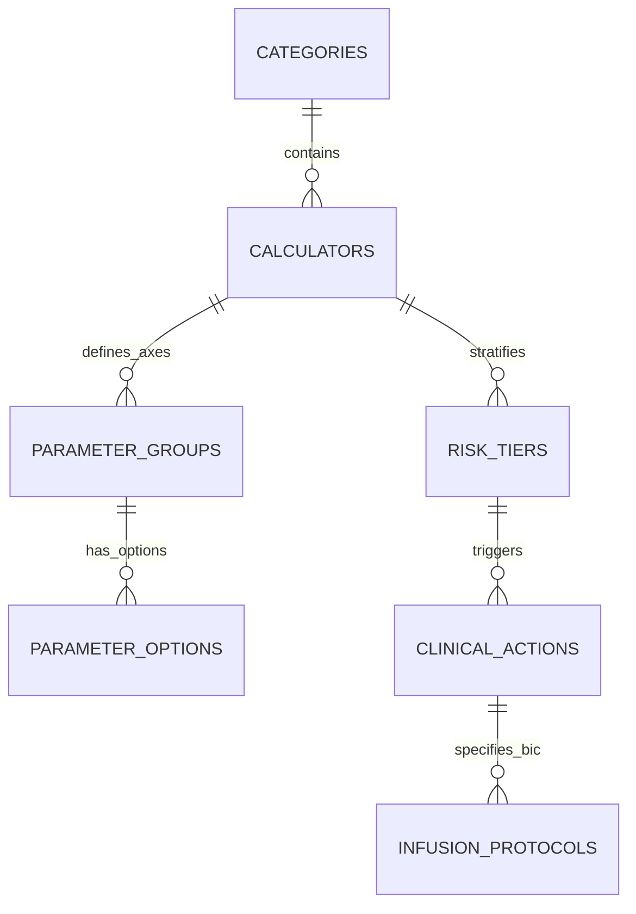
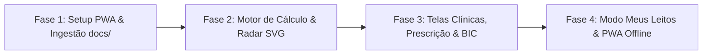

# Proposta Técnica e Arquitetural: App de Calculadoras Médicas e Suporte à Decisão Clínica (CDSS)

> **Aviso Legal e Regulatório:** Este software enquadra-se como Ferramenta de Apoio e Suporte à Decisão Clínica informada (*Clinical Decision Support System - CDSS*), em estrita conformidade com a **RDC ANVISA 657/2022** e resoluções do **Conselho Federal de Medicina (CFM)**. As informações e cálculos têm caráter exclusivamente educacional e de auxílio assistencial, não substituindo o exame físico presencial, o raciocínio diagnóstico e o julgamento individualizado do profissional médico com registro ativo.

---

## 1. Visão Geral do Produto e Proposta de Valor

### 1.1 Declaração do Problema
A prática médica contemporânea em setores críticos (Unidades de Pronto Atendimento, Salas Vermelhas, Enfermarias e Unidades de Terapia Intensiva) exige decisões rápidas fundamentadas em estratificações de risco estatísticas. No entanto, as calculadoras clínicas comerciais vigentes (como MDCalc e QxMD) funcionam como sistemas estáticos e "cegos": recebem variáveis laboratoriais e clínicas e devolvem um número isolado ou uma categoria vaga, abandonando o médico no momento mais crítico da assistência. 

O médico assistente necessita consultar múltiplos manuais, PDFs e bulários para encontrar:
1. O fármaco de escolha na dose de ataque e manutenção;
2. As diluições hospitalares padronizadas para bomba de infusão contínua (BIC);
3. As correções obrigatórias por função renal (Clearance de Creatinina) e peso;
4. As contraindicações absolutas e metas da janela de ouro;
5. A redação padronizada para colar no prontuário eletrônico (PEP).

### 1.2 A Solução: Scoreboard App
O **Scoreboard App** é um Sistema Móvel de Suporte à Decisão Clínica (*Mobile-First CDSS*) de alta velocidade e operação offline-first que converte automaticamente qualquer pontuação clínica em quatro pilares imediatos:

1. **Estratificação de Risco e Desfecho Estatístico Concreto:** Probabilidade empírica validada na literatura primária (ex.: mortalidade intra-hospitalar, risco de MACE em 6 semanas, probabilidade de TEP).
2. **Conduta Farmacológica Acionável:** Fármacos com posologia estrita, vias de administração, diluições padronizadas, titulação de drogas vasoativas e alertas de ajuste renal.
3. **Conduta Não Farmacológica e Intervencionista:** Destino assistencial (alta orientada, observação clínica, enfermaria com telemetria ou vaga imediata em UTI), suporte ventilatório protetor, linha arterial, monitorização seriada e tempo porta-procedimento.
4. **Dashboard de Desvio Fisiológico:** Visualização gráfica espacial em tempo real comparando a homeostase de um indivíduo sadio de referência com o desvio orgânico multieixo do paciente.

---

## 2. Princípios de UX/UI & FrontCraft Master v2.0

O design do Scoreboard App adota as diretrizes do **FrontCraft Master v2.0**, com foco em ergonomia móvel para cenários de alto estresse:

- **Mobile-First & One-Thumb Operation:** Elementos críticos posicionados dentro da zona de alcance natural do polegar, barra de navegação inferior com alvos de toque mínimos de 48×48px respeitando a `safe-area-inset-bottom`.
- **Física Tátil e Profundidade (Zero Flatness):** Chanfro físico de 1px na borda superior das superfícies (`shadow-bevel`) e sombras volumétricas em multicamada combinando sombra ambiente difusa e sombra de oclusão de contato.
- **Hierarquia Visual e Acessibilidade (WCAG 2.1 AA/AAA):**
  - **Estabilidade / Baixo Risco:** `#10B981` (Emerald 500)
  - **Alerta / Risco Moderado:** `#F59E0B` (Amber 500)
  - **Emergência / Alto Risco / Crítico:** `#EF4444` (Red 500)
  - **Contraste Rígido:** Verificação de luminosidade relativa $L = 0.2126R + 0.7152G + 0.0722B$ para legibilidade garantida sob iluminação hospitalar intensa.
- **Teclado Adaptado com Validação Instantânea:** Campos numéricos com máscaras automáticas nas unidades padrão brasileiras (mg/dL, mmHg, mL/min), prevenindo valores aberrantes.
- **Modo Score Avulso Direto:** O médico pode selecionar diretamente qualquer escore individual (ex.: apenas HEART, apenas CURB-65 ou apenas Cockcroft-Gault) e preencher estritamente seus parâmetros, obtendo o resultado em poucos segundos sem etapas desnecessárias.
- **Favoritos do Dia a Dia (Quick-Pins ⭐):** Sistema de fixação com estrela na tela principal para acesso imediato em 1 toque aos escores mais frequentes do plantão (ex.: SOFA na UTI, HEART na Sala Vermelha, KDIGO na enfermaria), mantidos localmente no navegador via IndexedDB/localStorage.
- **Fluxo em 3 Toques:** Seleção da Especialidade/Favorito $\rightarrow$ Escolha da Calculadora $\rightarrow$ Entrega da Conduta e Prescrição Completa.

---

## 3. Dashboard de Desvio Fisiológico (Normal vs. Paciente)

O diferencial visual exclusivo do sistema oferece ao médico uma representação espacial imediata do comprometimento orgânico:

### 3.1 Gráfico Radar Multidimensional (SVG Matemático Puro)
- **Eixos Poligonais:** Cada variável fundamental do escore (ex.: hemodinâmica, lesão miocárdica/troponina, ECG, disfunção renal, idade) constitui um vértice radial do polígono.
- **Linha Basal de Higidez (Polígono Verde Central):** Formada pelos valores ideais de normalidade (parâmetros basais de um indivíduo sadio, desvio = 0).
- **Polígono Dinâmico do Paciente (Sobreposição Laranja/Vermelha):** Conforme as variáveis são marcadas, os vértices se expandem radialmente em tempo real em direção à periferia, revelando instantaneamente qual sistema orgânico é o causador da instabilidade.
- **Zero Bloatware:** Implementado em SVG nativo reativo de alta performance (60fps no mobile), sem sobrecarga de bibliotecas pesadas de terceiros.

### 3.2 Barra Linear de Gradiente com Marcadores Duplos
- Barra contínua de severidade (verde $\rightarrow$ amarelo $\rightarrow$ vermelho).
- **Marcador Fixo:** Ícone de homeostase no ponto neutro.
- **Marcador Dinâmico:** Ponteiro deslizante proporcional ao z-score do paciente.

---

## 4. Modelagem Relacional de Dados (PostgreSQL / Supabase & SQLite/IndexedDB)

### 4.1 Diagrama Entidade-Relacionamento


### 4.2 Script DDL Completo (SQL)
```sql
CREATE EXTENSION IF NOT EXISTS "uuid-ossp";

-- 1. Categorias / Especialidades Clínicas (9 Blocos)
CREATE TABLE categories (
    id UUID PRIMARY KEY DEFAULT uuid_generate_v4(),
    name VARCHAR(100) NOT NULL,
    slug VARCHAR(100) UNIQUE NOT NULL,
    icon_name VARCHAR(50),
    sort_order INT DEFAULT 0
);

-- 2. Tabela Mestra de Calculadoras e Escores Clínicos
CREATE TABLE calculators (
    id UUID PRIMARY KEY DEFAULT uuid_generate_v4(),
    category_id UUID REFERENCES categories(id) ON DELETE CASCADE,
    name VARCHAR(150) NOT NULL,
    acronym VARCHAR(20) NOT NULL,
    slug VARCHAR(100) UNIQUE NOT NULL,
    summary TEXT NOT NULL,
    calculation_type VARCHAR(30) NOT NULL, -- 'additive_points', 'continuous_formula', 'branching_decision'
    formula_expression TEXT,
    evidence_source TEXT,
    min_possible_score NUMERIC(6,2),
    max_possible_score NUMERIC(6,2),
    created_at TIMESTAMP WITH TIME ZONE DEFAULT NOW()
);

-- 3. Variáveis / Eixos de Entrada (Alimentam os raios do Gráfico Radar)
CREATE TABLE parameter_groups (
    id UUID PRIMARY KEY DEFAULT uuid_generate_v4(),
    calculator_id UUID REFERENCES calculators(id) ON DELETE CASCADE,
    name VARCHAR(100) NOT NULL,
    slug VARCHAR(50) NOT NULL,
    input_type VARCHAR(30) NOT NULL, -- 'single_choice', 'boolean', 'numeric_input'
    unit VARCHAR(20),
    normal_baseline_value NUMERIC(6,2) DEFAULT 0,
    max_axis_value NUMERIC(6,2) DEFAULT 2,
    sort_order INT NOT NULL
);

-- 4. Opções de Resposta e Pontuação
CREATE TABLE parameter_options (
    id UUID PRIMARY KEY DEFAULT uuid_generate_v4(),
    parameter_group_id UUID REFERENCES parameter_groups(id) ON DELETE CASCADE,
    label VARCHAR(200) NOT NULL,
    point_value NUMERIC(6,2) NOT NULL,
    is_normal_baseline BOOLEAN DEFAULT FALSE,
    sort_order INT NOT NULL
);

-- 5. Faixas de Risco / Estratificação da Pontuação
CREATE TABLE risk_tiers (
    id UUID PRIMARY KEY DEFAULT uuid_generate_v4(),
    calculator_id UUID REFERENCES calculators(id) ON DELETE CASCADE,
    label VARCHAR(100) NOT NULL,
    severity_level VARCHAR(20) NOT NULL, -- 'low', 'intermediate', 'high', 'critical'
    min_score NUMERIC(6,2) NOT NULL,
    max_score NUMERIC(6,2) NOT NULL,
    statistical_outcome TEXT NOT NULL,
    color_hex VARCHAR(7) NOT NULL
);

-- 6. Condutas Médicas Acionáveis por Faixa de Risco
CREATE TABLE clinical_actions (
    id UUID PRIMARY KEY DEFAULT uuid_generate_v4(),
    risk_tier_id UUID REFERENCES risk_tiers(id) ON DELETE CASCADE,
    action_type VARCHAR(30) NOT NULL, -- 'pharmacological' ou 'non_pharmacological'
    drug_name VARCHAR(150),
    dosage VARCHAR(100),
    route VARCHAR(30),
    frequency VARCHAR(50),
    dilution_instructions TEXT,
    renal_adjustment TEXT,
    contraindications TEXT,
    recommendation_title VARCHAR(200) NOT NULL,
    disposition_target VARCHAR(100), -- 'Alta Orientada', 'Observação', 'Enfermaria', 'UTI'
    monitoring_plan TEXT,
    interventional_procedure TEXT,
    sort_order INT NOT NULL
);

-- 7. Protocolos Operacionais de Bomba de Infusão Contínua (BIC)
CREATE TABLE infusion_protocols (
    id UUID PRIMARY KEY DEFAULT uuid_generate_v4(),
    clinical_action_id REFERENCES clinical_actions(id) ON DELETE CASCADE,
    drug_name VARCHAR(150) NOT NULL,
    standard_solution TEXT NOT NULL,
    concentrated_solution TEXT,
    initial_dose_mcg_kg_min NUMERIC(8,4),
    maintenance_dose_mcg_kg_min NUMERIC(8,4),
    max_dose_mcg_kg_min NUMERIC(8,4),
    solution_concentration_mcg_ml NUMERIC(10,2) NOT NULL,
    administration_route VARCHAR(50) NOT NULL,
    nursing_precautions TEXT NOT NULL
);
```

---

## 5. Motor de Cálculo e Regras de Execução

O motor clínico resolve 3 famílias de cálculos:

1. **Modelos Aditivos Discretos (ex.: HEART, CURB-65, qSOFA, Alvarado, CHA2DS2-VASc):** Somatório direto dos pontos atribuídos a cada item selecionado em `parameter_options`, indexando a faixa de corte em `risk_tiers`.
2. **Modelos Contínuos e Equações Matemáticas (ex.: Cockcroft-Gault, CKD-EPI, Parkland, MELD, Ânion Gap, Delta Gap):** Execução client-side tipada em TypeScript e validada com Zod, com conversão paramétrica das variáveis em z-scores para alimentar o radar.
3. **Modelos em Árvore de Decisão / Algorítmicos (ex.: Wells para TEP com D-Dímero, Critérios de Berlim para SDRA):** Fluxos ramificados condicionais onde cada resposta dita a próxima etapa.

---

## 6. Módulo de Prescrição Hospitalar e Guia de BIC

Para faixas intermediárias e críticas, o aplicativo gera uma prescrição médica estruturada e guia de cálculo de BIC:

### 6.1 Memória de Cálculo Físico de Infusão
$$\text{Vazão (mL/h)} = \frac{\text{Dose prescrita } (\mu\text{g/kg/min}) \times \text{Peso } (\text{kg}) \times 60}{\text{Concentração da Solução } (\mu\text{g/mL})}$$

### 6.2 Protocolos Operacionais Padrão (POP)
- **Noradrenalina (Hemitartarato de Norepinefrina):**
  - *Solução Padrão:* 4 ampolas (4 mg/4 mL cada = 16 mg) + 234 mL SG 5% (Total: 250 mL $\rightarrow 64\ \mu\text{g/mL}$).
  - *Doses:* Inicial 0,05 a 0,1 $\mu\text{g/kg/min}$; Usual: 0,1 a 0,5 $\mu\text{g/kg/min}$; Teto: 1,0 a 2,0 $\mu\text{g/kg/min}$. Alvo: PAM $\ge 65\text{ mmHg}$.
  - *Cuidados:* Acesso venoso central mandatório; contraindicada diluição em SF 0,9% (risco de oxidação precoce).
- **Vasopressina:**
  - *Solução Padrão:* 1 ampola (20 UI/1 mL) + 99 mL SF 0,9% ou SG 5% ($0,2\text{ UI/mL}$).
  - *Dose Fixa no Choque:* 0,01 a 0,04 UI/min (poupador de noradrenalina se dose $> 0,25\ \mu\text{g/kg/min}$).
- **Dobutamina:**
  - *Solução Padrão:* 1 ampola (250 mg/20 mL) + 230 mL SG 5% ($1.000\ \mu\text{g/mL}$).
  - *Dose:* 2,5 a 20 $\mu\text{g/kg/min}$.
- **Nitroglicerina (Tridil):**
  - *Solução Padrão:* 1 ampola (50 mg/10 mL) + 240 mL SG 5% ($200\ \mu\text{g/mL}$). Frasco de polietileno/vidro obrigatório.

### 6.3 Botão "Copiar para PEP"
Gera texto puro padronizado com data, escore, variáveis, desfecho, prescrição e condutas para colagem imediata em sistemas hospitalares (**MV Soul, Tasy, Epimed, Philips, Pixeon**).

---

## 7. Taxonomia Completa: 9 Blocos e 20 Módulos Clínicos (MECE)

- **Bloco 1: Emergência, Choque e Terapia Intensiva**
  - Módulo 01: Sepse, Choque Séptico e Disfunção Orgânica (qSOFA, SOFA, APACHE II/IV, SAPS 3)
  - Módulo 02: Tromboembolismo Venoso - TVP e TEP (Wells TVP, Wells TEP, Geneva Revisado, PERC, PESI, sPESI)
  - Módulo 03: Coma, Nível de Consciência e Sedação (Glasgow-P, FOUR, RASS, SAS, CAM-ICU)
  - Módulo 04: Pancreatite Aguda de Emergência (Ranson, BISAP, Balthazar, Marshall Modificado)
- **Bloco 2: Cardiologia e Hemodinâmica**
  - Módulo 05: Dor Torácica e SCA (HEART Score, TIMI Risk, GRACE 2.0, Killip-Kimball)
  - Módulo 06: Fibrilação Atrial e Anticoagulação (CHA2DS2-VASc, HAS-BLED, ATRIA)
  - Módulo 07: Insuficiência Cardíaca e Risco Hemodinâmico (Framingham, NYHA, MAGGIC Risk)
- **Bloco 3: Neurologia e Neurocirurgia**
  - Módulo 08: AVC Isquêmico, Hemorrágico e Neurotrauma (NIHSS, ABCD2, ICH Score, Fisher, Hunt-Hess, ASPECTS, EDSS)
- **Bloco 4: Pneumologia**
  - Módulo 09: Pneumonia Adquirida na Comunidade (CURB-65, CRB-65, PSI/PORT, SMART-COP)
  - Módulo 10: DPOC e Asma (GOLD ABCD, Índice BODE, mMRC, Wood-Downes)
- **Bloco 5: Cirurgia Geral e Trauma**
  - Módulo 11: Abdome Agudo e Apendicite (Alvarado, RIPASA, Critérios de Tokyo)
  - Módulo 12: Trauma e Ressuscitação Volêmica (RTS, ISS, TRISS, Fórmula de Parkland)
  - Módulo 13: Risco Cirúrgico Pré-Operatório (Classificação ASA, Goldman, RCRI de Lee, Caprini)
- **Bloco 6: Nefrologia e Meio Interno**
  - Módulo 14: Injúria Renal Aguda e Doença Renal Crônica (KDIGO/AKIN, RIFLE, CKD-EPI 2021, Cockcroft-Gault)
  - Módulo 15: Distúrbios Hidroeletrolíticos e Ácido-Base (Ânion Gap, Delta Gap, Déficit de Água Livre)
- **Bloco 7: Hepatologia e Gastroenterologia**
  - Módulo 16: Cirrose, Insuficiência Hepática e Transplante (Child-Pugh, MELD, MELD-Na, Maddrey)
  - Módulo 17: Hemorragia Digestiva Alta e Baixa (Rockall, Glasgow-Blatchford, AIMS65)
- **Bloco 8: Pediatria e Neonatologia**
  - Módulo 18: Sala de Parto e Triagem Neonatal (Apgar, Silverman-Andersen, Ballard/Capurro, Kramer)
  - Módulo 19: Emergência e Sepse Pediátrica (PEWS, Glasgow Pediátrico, PELOD-2, Holliday-Segar)
- **Bloco 9: Hematologia e Reumatologia**
  - Módulo 20: Anemias, Citopenias e Sangramento (Índice de Mentzer, Escore de CIVD da ISTH, 4Ts para HIT)

---

## 8. Aspectos Regulatórios (SaMD), Privacidade e Segurança

- **RDC ANVISA 657/2022 & Resoluções CFM:** O software atua estritamente como suporte à decisão clínica informada. Todas as intervenções farmacológicas contêm citação direta e rastreável do estudo derivador ou diretriz pública (SBC, AMIB, AHA, ESC, KDIGO).
- **Privacy-by-Design & LGPD:** Nenhum dado nominal (nome, CPF, data de nascimento) é transmitido ou armazenado. Os dados residem em memória volátil de execução ou no armazenamento local do navegador (IndexedDB) sob códigos anônimos de leito ("Leito 03 - UTI").
- **Engenharia 100% Offline-First:** O PWA empacota o catálogo completo de regras e assets no Service Worker, permitindo funcionamento instantâneo em subsolos hospitalares e salas blindadas sem rede.

---

## 9. Plano de Implementação Técnico e Roadmap Integrado

Alinhado na sessão iterativa `/grill-me`, o plano de entrega estrutura-se em 4 fases sequenciais determinísticas:



### Fase 1: Setup do PWA Mobile-First e Ingestão do Catálogo de Dados (`docs/`)
- Inicialização do projeto Vite + React 18 + TypeScript + Tailwind CSS em `projects/scoreboard-app/`.
- Configuração dos tokens táteis do FrontCraft Master v2.0 (`tailwind.config.js` e `index.css`).
- Desenvolvimento do script extrator `scripts/ingest_clinical_data.py` para processar as especificações de `docs/01_especificacoes_clinicas/` e gerar `src/data/clinical_scores.json`.
- Criação dos schemas Zod em `src/types/clinical_schema.ts`.

### Fase 2: Motor de Cálculo Matemático e Componentes de Desvio Fisiológico
- Implementação de `calculationEngine.ts` cobrindo modelos aditivos, contínuos e árvores decisórias.
- Implementação de `infusionEngine.ts` com a fórmula exata de BIC e matriz de titulação de drogas vasoativas.
- Construção do componente `PhysiologicalRadar.tsx` em SVG matemático puro reativo.
- Construção do componente `SeverityGradientBar.tsx` com marcadores de homeostase e paciente.

### Fase 3: Interface Clínica, Prescrição Hospitalar e Integração com PEP
- Implementação de `SpecialtyBrowser.tsx` com navegação nos 9 blocos e 20 módulos clínicos.
- Implementação de `CalculatorView.tsx` com máscaras de entrada e atualização instantânea do radar.
- Implementação de `PrescriptionCard.tsx` com condutas farmacológicas, diluições de BIC, condutas não farmacológicas e botão "Copiar para PEP".

### Fase 4: Modo Meus Leitos (IndexedDB), Service Worker PWA e Testes
- Implementação de `storageService.ts` e `BedsManager.tsx` para acompanhamento anônimo de leitos durante o plantão.
- Configuração do manifesto PWA e Service Worker offline via `vite-plugin-pwa`.
- Execução do pipeline de testes determinísticos de contrato e cálculo (Vitest + Python Integrity Suite).
- Geração do relatório final de homologação técnica.

---

## 10. Matriz de Rastreabilidade de Arquivos

| Diretório | Finalidade | Arquivos Chave |
| :--- | :--- | :--- |
| `docs/00_proposta_e_arquitetura/` | Especificação técnica mestre e plano | `PROPOSTA_TECNICA_E_ARQUITETURAL_ATUALIZADA.md`, `Proposta_Original_Calculadoras_Medicas.pdf` |
| `docs/01_especificacoes_clinicas/` | Guias clínicos monográficos e dossiês (20 módulos) | `Bloco_01` a `Bloco_09` (.pdf e .docx), `MATRIZ_TAXONOMIA_20_MODULOS.md` |
| `docs/02_design_system_ui/` | Estúdio e tokens táteis FrontCraft Master v2.0 | `frontcraft_master_v2_0_estudio_reativo.html`, `especificacao_design_system_tokens.md` |
| `docs/03_protocolos_prescricao_bic/` | Diretrizes de infusão contínua e conduta médica | `protocolo_mestre_prescricao_e_bic.md`, `diretriz_geral_preceptor_uti.md` |
| `docs/_bruto_original/` | Backup dos arquivos brutos originais do Drive | Arquivos originais intactos |
